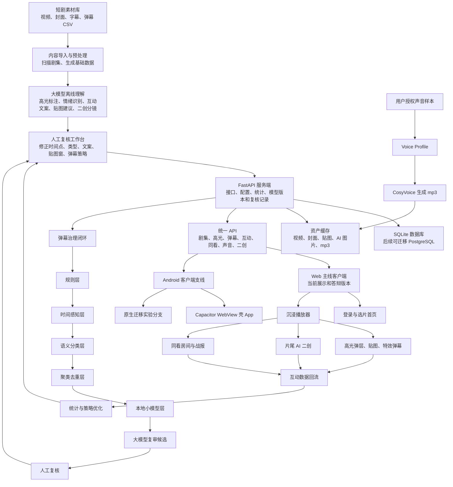
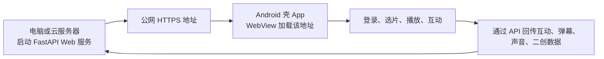

# 半句：基于短剧剧情理解的即时互动激发系统

<p align="center">
  
</p>

<h1 align="center">半句</h1>

<p align="center">
  <strong>短剧陪伴 · 剧情理解 · 即时互动</strong>
</p>

<p align="center">
  把短剧里的冲突、反转、甜蜜、虐心和名场面，转化成可以被模型理解、被人工复核、被客户端即时触发的低门槛互动体验。
</p>

## 项目展示

| 展示内容 | 入口 |
| --- | --- |
| 项目流程演示 | [Bilibili 观看](https://www.bilibili.com/video/BV1KJEz6BEiW/?spm_id_from=333.1387.homepage.video_card.click&vd_source=1e173b313bd91925408feaa275abf67b) |
| Android 端演示 | [GitHub 视频页观看](https://github.com/leoelio/Understanding-Short-Dramas/blob/main/docs/media/android-demo.mp4) |

> 主要产品流程请看第一个项目流程视频；Android 端演示只展示端侧登录、选剧和播放等部分能力，功能设计与 Web 主线一致，不在该视频中完整展开。

> 本地项目流程视频约 316MB，超过 GitHub 单文件限制，因此 README 使用外部展示链接。

## 产品定位

| 维度 | 说明 |
| --- | --- |
| 面向场景 | 短剧观看、剧情高光互动、同看社交、片尾 AI 二创 |
| 核心问题 | 用户有强烈情绪表达需求，但打字评论会打断观看；平台也需要知道哪些剧情真正激发互动 |
| 产品解法 | 用大模型理解剧情，用复核工作台沉淀配置，用客户端在关键时间点触发低打扰互动 |
| 当前主线 | 电脑端 Web 展示版，优先保证完整产品闭环和稳定演示 |
| Android 支线 | 保留安装包和迁移实验，用于验证移动端承载方式 |

半句是一套面向短剧观看场景的 AI 全栈产品原型。系统通过“大模型理解剧情 + 人工复核 + 服务端配置 + 客户端互动 + Android App 支线”的方式，把短剧中的冲突、反转、爽点、甜蜜、虐心、悬念等剧情高光转化成低门槛互动体验。

当前主线是电脑端 Web 展示版；Android 端作为支线保留，用于安装包、公网访问和后续原生迁移。

## 当前版本

| 项目 | 状态 |
| --- | --- |
| 稳定 Web 版本 | `v1.0.0-web-desktop` |
| 主分支 | `main`，用于 Web 展示和交付 |
| Web 开发分支 | `web-product` |
| Android 支线 | `native-android-migration`，用于原生迁移实验 |
| Android 壳 App | `mobile/banju-android` |
| 默认本地地址 | `http://127.0.0.1:8000/` |

## 核心能力

- 短剧列表、登录后选片首页、最近观看、热剧推荐和分类筛选。
- 沉浸式播放页：高光时间轴、情绪热力轨道、弹幕三档、贴图动效、疯狂点击、同看房间。
- 高光互动：按剧情时间自动触发问答、投票、贴图和特效弹幕。
- 弹幕治理：规则过滤、时间感知剧透延后、语义判断、聚类去重、小模型打分、大模型候选复审、人工复核。
- 片尾 AI 二创：剧情分支选择、分镜图片、原版声音/用户声音入口。
- 声音资产服务：用户授权录音、保存 voice profile、调用本地 CosyVoice 生成 mp3 并缓存。
- 同看与社交：好友、申请审核、聊聊、逛逛、同看房间、房间动态和勋章展馆。
- 复核工作台：高光、贴图时间窗、体验配置、理解可视化、弹幕治理可视化。

## 项目目录

```text
backend/        FastAPI 服务端
frontend/       Web 客户端、复核页、后台页和静态资源
mobile/         Android 壳 App 和原生迁移支线代码
scripts/        导入、标注、训练、构建、隧道和维护脚本
docs/           项目文档、答辩材料、部署说明、接口说明
data/           本地数据库、模型缓存、声音缓存等运行数据
avatars/        系统头像池
视频库/         本地短剧素材目录，不建议提交到 Git
```

## 整体系统流程图



补充图片版流程图见：[docs/overall_flow_web_android_feishu.png](docs/overall_flow_web_android_feishu.png)。

## 从 0 运行 Web 端

### 1. 克隆仓库

```powershell
git clone https://github.com/leoelio/Understanding-Short-Dramas.git
cd Understanding-Short-Dramas
git checkout main
```

如果要回到当前稳定展示版：

```powershell
git checkout v1.0.0-web-desktop
```

### 2. 准备 Python 环境

推荐 Python 3.11 或兼容版本。

```powershell
python -m venv .venv
.\.venv\Scripts\python.exe -m pip install -r backend\requirements.txt
```

### 3. 准备视频素材

把短剧素材放到项目根目录的 `视频库/` 下。当前 Demo 约定是十部剧，每部至少 2 集，服务启动时会扫描素材并导入基础剧集数据。

视频素材体积通常较大，不建议提交到 Git。

### 4. 配置环境变量

复制示例文件：

```powershell
Copy-Item .env.example .env
```

`.env` 只保存在本地，不能提交真实密钥。常用变量：

| 变量 | 说明 |
| --- | --- |
| `DATABASE_URL` | 默认 `sqlite:///./data/app.db` |
| `VIDEO_LIBRARY_PATH` | 视频库路径，默认 `./视频库` |
| `ARK_API_KEY` | 大模型 API Key，不要写进文档或提交 |
| `ARK_ENDPOINT_ID` / `ARK_MODEL` | 大模型接入点或模型名 |
| `ARK_BASE_URL` | 大模型兼容接口地址 |
| `OPENAI_API_KEY` | 可选，用于图片/文本生成能力 |
| `COSYVOICE_BASE_URL` | 本地声音服务地址，默认 `http://127.0.0.1:50001` |
| `VOICE_ASSET_DIR` | 声音样本和生成音频缓存目录 |

### 5. 启动服务

```powershell
.\.venv\Scripts\python.exe -m uvicorn backend.app.main:app --reload --host 127.0.0.1 --port 8000
```

打开：

```text
Web 首页：http://127.0.0.1:8000/
API 文档：http://127.0.0.1:8000/docs
复核页：http://127.0.0.1:8000/#review
后台页：http://127.0.0.1:8000/#admin
```

重点演示地址：

```text
北往第 1 集：http://127.0.0.1:8000/?episode=3
北往片尾二创：http://127.0.0.1:8000/?episode=3&remix=1
那年冬至第 1 集：http://127.0.0.1:8000/?episode=19
```

## Web 公网演示部署

### 临时公网隧道

适合比赛、答辩、远程体验。不适合作为长期生产地址。

先启动本地服务，再执行：

```powershell
.\scripts\start_public_tunnel.ps1
```

脚本会输出一个 `https://xxxx.trycloudflare.com` 地址。把这个地址发给别人即可访问。

停止隧道：

```powershell
.\scripts\stop_public_tunnel.ps1
```

注意：

- 本地电脑关机、服务停止或隧道停止后，公网地址会失效。
- Quick Tunnel 地址通常不是固定的。
- 如果要长期上线，应使用云服务器、固定域名、HTTPS 证书和进程守护。

### 云服务器正式部署建议

1. 准备 Linux 云服务器。
2. 安装 Python 3.11、Nginx、Git。
3. 克隆仓库并配置 `.env`。
4. 使用 `uvicorn` 或 `gunicorn + uvicorn worker` 启动 FastAPI。
5. Nginx 反向代理到 `127.0.0.1:8000`。
6. 配置 HTTPS。
7. 把视频、AI 图片、声音缓存迁移到服务器磁盘或对象存储。
8. SQLite 后续建议迁移到 PostgreSQL。

## Android 端说明

Android 当前有两条路线：

| 路线 | 位置 | 用途 | 当前建议 |
| --- | --- | --- | --- |
| WebView 壳 App | `mobile/banju-android` | 打包成 APK，加载公网 Web 地址 | 可用于安装包演示 |
| 原生迁移实验 | `native-android-migration` 分支 | 验证原生登录、选片、播放、高光、弹幕 | 继续实验，不影响 Web 主线 |

当前最稳定的演示方式仍然是电脑端 Web。Android 壳 App 适合证明“可以安装到手机”，但播放体验、全屏交互和复杂二创仍以 Web 主线为准。

### Android 壳 App 从 0 构建

前置要求：

- Node.js
- JDK 21
- Android SDK
- 可访问的 HTTPS Web 地址，例如 Cloudflare Tunnel 地址或正式域名

进入 Android 工程：

```powershell
cd mobile\banju-android
npm install
```

修改 `mobile/banju-android/capacitor.config.json`：

```json
{
  "server": {
    "url": "https://你的公网地址",
    "cleartext": false
  }
}
```

回到项目根目录构建：

```powershell
cd ..\..
.\scripts\build_banju_android_debug.ps1
```

APK 输出位置：

```text
mobile\banju-android\android\app\build\outputs\apk\debug\app-debug.apk
```

安装到已连接的 Android 手机：

```powershell
.\scripts\install_banju_android_debug.ps1
```

### Android 真机使用逻辑



关键点：

- 手机不需要和电脑处于同一局域网，只要 App 配置的是公网 HTTPS 地址。
- 如果使用临时隧道，隧道地址变化后需要更新 `capacitor.config.json` 并重新打包。
- 后续如果做真正原生 App，建议只复刻最核心链路：登录、选剧、视频播放、高光弹层、弹幕、片尾二创入口。

## 模型与 AI 能力

### 大模型

大模型主要用于离线或半离线任务：

- 剧情理解和高光标注。
- 高光类型、情绪标签和互动文案生成。
- 贴图/表情包建议。
- 弹幕批量语义审核。
- 片尾 AI 二创分支文案和分镜提示词。

真实密钥必须放在 `.env`，不能写入代码、README、提交信息或截图。

连通性测试：

```powershell
.\.venv\Scripts\python.exe scripts\test_llm_connection.py
```

### 弹幕治理小模型

当前小模型是项目内训练的轻量可解释词权重模型，训练结果在：

```text
data/danmaku_small_model.json
```

训练脚本：

```powershell
.\.venv\Scripts\python.exe scripts\train_danmaku_small_model.py
```

它不是大型神经网络模型，而是用人工复核结果训练出的本地快速判断层。它负责给弹幕通过倾向和置信度打分，低置信度或高风险内容再进入大模型候选复审和人工复核。

### 声音资产服务

声音功能依赖本地 CosyVoice 服务：

```text
默认地址：http://127.0.0.1:50001
```

使用方式：

1. 在“我的”页面上传或录入授权声音样本。
2. 后端保存为 voice profile。
3. 片尾 AI 二创或陪看提示需要语音时，调用 CosyVoice 生成 mp3。
4. 生成结果会缓存，避免每次重复生成。

## 常用脚本

| 脚本 | 用途 |
| --- | --- |
| `scripts/annotate_with_llm.py` | 调用大模型做高光标注 |
| `scripts/apply_annotations.py` | 写回标注结果 |
| `scripts/generate_episode_experience_with_llm.py` | 生成单集体验配置 |
| `scripts/import_danmaku_csv.py` | 导入弹幕 CSV |
| `scripts/govern_danmaku.py` | 运行弹幕治理 |
| `scripts/review_danmaku_with_llm.py` | 大模型批量复审弹幕 |
| `scripts/train_danmaku_small_model.py` | 训练弹幕小模型 |
| `scripts/start_public_tunnel.ps1` | 启动临时公网隧道 |
| `scripts/stop_public_tunnel.ps1` | 停止临时公网隧道 |
| `scripts/build_banju_android_debug.ps1` | 构建 Android debug APK |
| `scripts/install_banju_android_debug.ps1` | 安装 Android debug APK |

## Git 分支策略

```text
main
  稳定 Web 展示版本，用于比赛展示、答辩和交付。

web-product
  Web 产品主开发分支。

native-android-migration
  Android 原生迁移实验分支，允许失败和重构，不影响 main。
```

推荐协作方式：

1. Web 功能先在 `web-product` 上验证。
2. 稳定后合并或快进到 `main`。
3. Android 原生实验只在 `native-android-migration` 做。
4. 重要可展示版本打 tag，例如 `v1.0.0-web-desktop`。

## 安全与隐私

- 不提交 `.env`。
- 不在文档、截图、提交信息里暴露 API Key。
- 用户声音、图片、视频等敏感资产默认只保存在本地。
- 公网演示前应确认没有真实用户隐私数据。
- 后续正式上线需要补充用户协议、内容安全策略、数据删除机制和访问权限控制。
