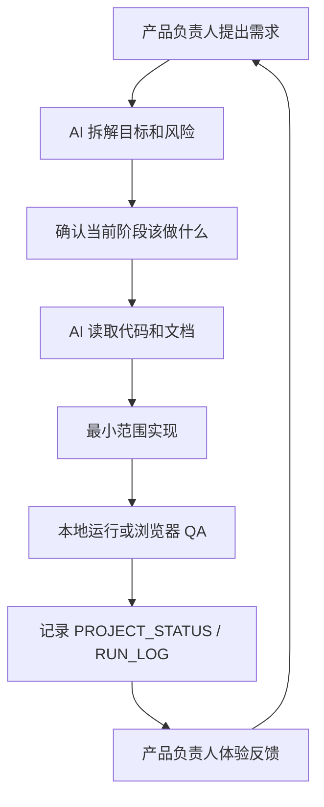

# AI 辅助开发说明

更新时间：2026-06-11

## 文档定位

本文说明“半句”项目如何使用 AI 辅助完成产品分析、技术规划、代码开发、UI 打磨、模型链路、素材生成和文档交付。

这份文档用于答辩说明，也用于后续团队接手时判断哪些内容由 AI 生成、哪些内容经过人工确认。

## 合作模式

项目采用“产品负责人 + AI 全栈工程协作”的模式：

- 产品负责人提出目标、素材、体验判断和关键决策。
- AI 负责拆解需求、给出技术方案、实现代码、生成文档、执行测试和记录状态。
- 关键技术选择和产品方向由产品负责人确认。
- 涉及密钥、隐私、声音授权、用户数据和上线策略时，优先采用保守方案。

## AI 参与范围

| 阶段 | AI 参与内容 | 人工确认点 |
| --- | --- | --- |
| 探索 | 分析用户问题、核心用户、MVP 边界、过大假设 | 产品目标和优先级 |
| 规划 | 客户端/服务端/数据库/模型路线选择 | 技术路线和阶段目标 |
| 构建 | 编写后端接口、前端交互、数据库结构、脚本 | 关键功能是否符合体验预期 |
| 打磨 | UI 视觉、播放器体验、高光弹层、弹幕、二创流程 | 观感、节奏、剧情贴合度 |
| 模型 | 高光标注提示词、贴图建议、弹幕治理、二创分镜、声音缓存 | 标注准确性和生成内容是否可展示 |
| 交付 | README、接口文档、数据库文档、部署说明、答辩稿 | 是否能用于比赛提交和讲解 |

## 需求到实现的流程

执行原则：

- 先保证完整 MVP 闭环，再做创新。
- 先读现有代码，再修改。
- 每次只改和当前目标直接相关的内容。
- 重要阶段更新项目状态，方便后续继续。

## 产品设计中的 AI 使用

AI 参与了以下产品判断：

1. MVP 降级
   - 第一版不直接做原生 App 和实时 AI 视频生成。
   - 优先做 Web 端完整闭环。
   - 后续再迁移 Android/iOS。

2. 高光分类体系
   - 从冲突、反转、爽点、甜蜜、虐心、悬念、搞笑、危机等类型整理成可配置体系。
   - 强调一集短剧不能全是高光，必须保持对比度。

3. 弹幕治理策略
   - 不用纯人工审核。
   - 采用规则、时间感知、语义分类、聚类、小模型和人工复核分层治理。

4. 片尾 AI 二创策略
   - 放弃不稳定实时视频生成。
   - 改为“图片分镜 + 点击翻页 + 声音带入 + 缓存资产”的稳定方案。

5. 声音资产策略
   - 用户先授权上传声音样本。
   - 系统只为固定文本生成缓存音频。
   - 不做无限实时语音生成。

## 代码开发中的 AI 使用

AI 主要完成：

- FastAPI 接口实现。
- SQLite/SQLAlchemy 表结构设计。
- 登录、用户、好友、聊天、同看、动态等服务端逻辑。
- Web 前端播放器、高光弹层、弹幕、片尾二创、个人主页、复核页等交互。
- 图片、语音、弹幕、标注等辅助脚本。
- 文档和状态记录。

代码开发约束：

- 不回滚用户已有改动。
- 不提交真实密钥。
- 不把本地视频素材、数据库、声音样本提交到 Git。
- 关键接口和数据结构写入文档。
- 对演示核心链路做本地验证。

## UI 打磨中的 AI 使用

AI 根据用户反馈多轮调整：

- 登录页和选片首页向高质感产品界面靠拢。
- 播放页减少无关字和顶部干扰。
- 控制栏按鼠标移动显示，闲置后隐藏。
- 高光弹层避开视频中心剧情区域。
- 贴图动效从固定位置改为更自然的时间窗和位置节奏。
- 片尾二创从普通卡片改为全屏沉浸式分镜选择。
- 同看房间和勋章展馆强化社交展示。

当前设计边界：

- Web 端电脑展示优先。
- 手机套壳不再作为当前主线。
- 原生 Android 迁移另分支推进，不和 Web 文档分支混在一起。

## 模型与资产生成中的 AI 使用

### 高光标注

AI 生成候选高光，人工复核后写回数据库。

人工重点检查：

- 时间点是否准确。
- 是否真的是强情绪点。
- 弹层是否遮挡剧情。
- 互动文案是否短、准、有情绪。

近期新增了一条批量升级链路：AI 不重新发现高光，而是在已有 20 集、65 个高光锚点上升级标题、描述、情绪、按钮和贴图时间窗。这个策略更稳，因为时间点仍由人工或已有系统锚定，模型只负责表达优化和体验建议。

### 贴图和动效

AI 可生成贴图建议、文案和视觉方向，但不直接覆盖线上体验。

原因：

- 贴图位置和时间需要结合实际视频判断。
- 贴图过密会破坏观看体验。
- 生成内容可能和剧情不匹配。

当前新增 6 个题材贴纸资产，并把全量剧集贴图时间窗写入体验配置草稿。后续复核重点是“贴不贴剧情、挡不挡画面、会不会太频繁”。

### 弹幕治理

AI 辅助做批量语义判断，但实时发送弹幕时优先用规则和本地治理。

这样可以降低：

- 实时延迟。
- API 成本。
- 模型不稳定性。

当前弹幕治理已升级为七层展示：规则、时间感知、语义分类、聚类去重、小模型、大模型复审候选、人工复核。小模型可以从复核结果重新训练，大模型复审保持离线候选队列，不进入实时播放主链路。

### 陪看智能人

AI 辅助设计了固定陪看员“小半”的产品形态：

- 播放中只做轻提示，不抢剧情。
- 高光前后给出短句提醒。
- 片尾整理观看战报。
- 形象展示支持 3D 版本和灵动眼睛版本。

这个能力目前是体验增强，不是开放式智能体。它不执行自由文本命令，不读取敏感信息，也不替代用户决策。

### 片尾二创

AI 参与：

- 三条故事分支扩写。
- 27 张图片提示词。
- 图片生成。
- 分镜文案。
- 声音台词。

人工确认：

- 主角是否正确。
- 画风是否接近原剧。
- 选择差异是否体现在画面中。
- 是否有不必要文字、水印、商标或车牌。
- 是否符合“AI 猜测，非正片内容”的边界。

### 声音资产

AI/模型参与：

- 使用本地 CosyVoice 根据授权样本生成音频。
- 生成结果缓存为 mp3。

人工和系统约束：

- 用户必须提供授权文本。
- 原版声音和用户声音分开缓存。
- 播放时避免多段声音重叠。
- 不把声音样本提交 Git。

## 文档开发中的 AI 使用

AI 已生成或整理：

- 项目交付总说明。
- 录屏脚本和答辩稿。
- API 接口说明。
- 数据库说明。
- 部署与运行说明。
- 模型使用说明。
- AI 辅助开发说明。

文档维护规则：

- 每次新增接口，更新 `API_REFERENCE.md`。
- 每次改表结构，更新 `DATABASE_SCHEMA.md`。
- 每次运行方式变化，更新 `DEPLOYMENT_GUIDE.md`。
- 每次模型链路变化，更新 `MODEL_USAGE.md`。
- 每次阶段结束，更新 `PROJECT_STATUS.md` 和 `RUN_LOG.md`。

## 安全与隐私处理

AI 辅助开发中明确禁止：

- 在文档中写真实 API Key。
- 在提交信息中写密钥。
- 把 `.env` 提交到 Git。
- 把用户声音样本、私密照片、原始视频素材提交到 Git。
- 在公开演示中展示不可公开的账号、密钥、素材路径。

密钥使用方式：

- 只读取本地 `.env`。
- 连通性测试只输出可用状态，不输出明文。
- 错误日志需要脱敏。

声音和头像资产：

- 用户上传内容应绑定用户。
- 后续应提供删除入口。
- 正式上线前必须补隐私协议和授权说明。

## 质量保障

AI 辅助开发不是直接“生成完就算完成”。当前项目使用以下方式控制质量：

1. 功能闭环验证
   - 能登录。
   - 能选片。
   - 能播放。
   - 能触发高光。
   - 能上报互动。
   - 能展示统计和复核。

2. 视觉 QA
   - 使用浏览器检查页面。
   - 检查全屏、弹层遮挡、二创入口时机、控制栏显示隐藏。

3. 数据可追踪
   - 高光有来源、置信度和模型版本。
   - 弹幕有治理分数和原因。
   - 二创有生成记录和精选状态。
   - 声音有 profile 和缓存记录。

4. 文档同步
   - 每轮重要变化写入 `RUN_LOG.md`。
   - 当前状态写入 `PROJECT_STATUS.md`。

## 当前不足

需要坦诚说明：

- 高光小模型尚未完成训练和部署。
- AI 视频生成不作为当前稳定交付能力。
- 弹幕小模型当前是轻量可解释模型，不是大规模生产审核系统。
- 声音服务依赖本地 CosyVoice，正式上线需要服务端化和任务队列。
- Android 原生迁移尝试过，但当前展示质量仍以 Web 主线为准。
- AI 生成图片、文案和声音都需要人工复核后才能作为正式演示资产。

## 答辩时可以这样讲

本项目不是简单把 AI 接到播放器上，而是把 AI 放进内容生产和运营闭环里：

1. 大模型负责理解剧情，生成候选高光、互动文案、贴图建议和二创分镜。
2. 人工复核保证时间点、剧情理解和演示质量。
3. 服务端把复核后的高光和体验配置下发给客户端。
4. 客户端在用户观看到关键剧情时触发低门槛互动。
5. 用户行为回流到后台，形成后续优化数据。
6. 小模型用于未来降低弹幕治理和高光识别成本。
7. 声音和图片生成采用缓存策略，保证演示稳定和成本可控。

这套方式比纯实时大模型更适合短剧互动产品，因为短剧观看需要流畅、准确、低打扰，而不是等待模型现场生成。
