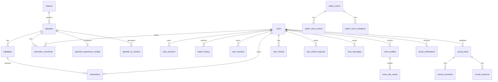

# 数据库说明

更新时间：2026-06-11

## 文档定位

本文说明当前“半句”后端数据库的核心表、关系和数据流。它不是逐字段 SQL DDL 导出，而是用于后续开发、答辩讲解和维护接手。

当前实现：

- ORM：SQLAlchemy
- 默认数据库：SQLite
- 默认路径：`data/app.db`
- 配置项：`DATABASE_URL`
- 建表方式：应用启动时执行 `Base.metadata.create_all`
- 轻量迁移：`backend/app/migrations.py` 对 SQLite 补充新增列

当前没有引入 Alembic。后续如果进入长期上线，应补正式迁移体系。

## 总体关系



## 核心内容表

### `dramas`

短剧主表。

| 字段 | 说明 |
| --- | --- |
| `id` | 主键 |
| `title` | 短剧名称，唯一 |
| `genre` | 题材类型 |
| `description` | 简介 |
| `created_at` | 创建时间 |

关系：

- 一部短剧包含多集 `episodes`。
- 启动时会扫描视频库目录，按文件夹建立短剧。

### `episodes`

剧集表。

| 字段 | 说明 |
| --- | --- |
| `id` | 主键 |
| `drama_id` | 所属短剧 |
| `episode_no` | 第几集 |
| `title` | 剧集标题 |
| `video_path` | 本地视频文件路径 |
| `duration_sec` | 视频时长 |
| `created_at` | 创建时间 |

关系：

- 一集对应多个 `highlights`。
- 一集可有一个 `episode_experience_configs`。
- 一集可有多条弹幕、观看历史和片尾二创记录。

### `highlights`

高光时间轴表，是项目最核心的数据结构。

| 字段 | 说明 |
| --- | --- |
| `id` | 主键 |
| `episode_id` | 所属剧集 |
| `start_time_sec` / `end_time_sec` | 高光触发时间窗 |
| `title` | 高光标题 |
| `description` | 高光说明 |
| `highlight_type` | 高光类型 |
| `emotion` | 情绪标签 |
| `options_json` | 互动选项 JSON |
| `source` | 标注来源，例如 `manual_seed`、`human_review` |
| `confidence` | 置信度 |
| `model_version` | 模型或复核版本 |
| `annotation_reason` | 标注理由 |
| `evidence_segment_ids_json` | 证据片段 ID JSON |
| `evidence_text` | 证据文本 |
| `created_at` | 创建时间 |

设计意图：

- 大模型、人工复核和后续小模型都通过 `source`、`confidence`、`model_version` 留痕。
- 客户端只需要按 `start_time_sec` 播放到点触发互动组件。

### `interactions`

用户对高光组件的点击和选择记录。

| 字段 | 说明 |
| --- | --- |
| `id` | 主键 |
| `highlight_id` | 被互动的高光 |
| `user_id` | 登录用户，可为空 |
| `option_key` | 选择的选项 |
| `session_id` | 游客或浏览器会话 ID |
| `created_at` | 创建时间 |

用途：

- 统计每个高光点的点击量和选项比例。
- 触发积分、称号、徽章等奖励。

### `episode_experience_configs`

单集体验配置表。

| 字段 | 说明 |
| --- | --- |
| `episode_id` | 剧集 ID，唯一 |
| `version` | 配置版本 |
| `source` | 配置来源 |
| `model_version` | 模型或配置生成版本 |
| `review_status` | 复核状态 |
| `config_json` | 播放器主题、贴图时间窗、弹幕策略、竞猜规则等完整 JSON |

设计意图：

- 把“播放器风格、贴图窗、竞猜奖励、二创入口”等体验策略从代码里迁出。
- 每集可单独调试，不影响其他短剧。

## 弹幕治理表

### `danmaku_comments`

弹幕表，同时保存治理结果。

| 字段 | 说明 |
| --- | --- |
| `episode_id` | 所属剧集 |
| `user_id` | 发送用户，可为空 |
| `time_sec` | 出现时间 |
| `text` | 展示文本 |
| `mode` | `light`、`carnival`、`curated`、`seed` |
| `session_id` | 会话 ID |
| `original_text` | 用户原始文本 |
| `source_like_count` | 导入弹幕原始点赞量 |
| `review_status` | `approved`、`needs_review`、`hidden` |
| `risk_score` | 风险分 |
| `quality_score` | 质量分 |
| `spoiler_score` | 剧透分 |
| `relevance_score` | 相关性分 |
| `cluster_key` | 聚类键 |
| `cluster_size` | 聚类大小 |
| `suggested_time_sec` | 建议展示时间 |
| `moderation_model_version` | 治理模型版本 |
| `moderation_layers_json` | 分层治理结果 |
| `moderation_reason` | 治理原因 |

弹幕治理当前目标：

- 不让明显低俗、广告、联系方式和剧透内容直接展示。
- 用模式字段支持轻聊、狂欢、沉浸三种观看体验。
- 用治理字段沉淀后续小模型训练数据。

## 用户与身份表

### `users`

用户主表。

| 字段 | 说明 |
| --- | --- |
| `username` | 登录名，唯一 |
| `display_name` | 展示昵称 |
| `avatar_url` | 头像地址 |
| `password_hash` | PBKDF2 密码哈希 |
| `role` | `user`、`reviewer`、`admin` |
| `is_active` | 是否启用 |
| `created_at` | 创建时间 |

说明：

- 密码不明文存储。
- 默认演示账号由启动逻辑创建，具体以本地代码为准，不在公开文档写账号密码。

### `auth_sessions`

登录会话表。

| 字段 | 说明 |
| --- | --- |
| `user_id` | 用户 ID |
| `token_hash` | token 哈希，不存明文 token |
| `expires_at` | 过期时间 |
| `created_at` | 创建时间 |

当前 session 有效期为 7 天。

### `watch_history`

观看历史表。

| 字段 | 说明 |
| --- | --- |
| `user_id` | 用户 ID |
| `episode_id` | 剧集 ID |
| `progress_sec` | 播放进度 |
| `updated_at` | 更新时间 |

用于首页最近观看和断点续播。

### `user_rewards`

用户成长奖励表。

| 字段 | 说明 |
| --- | --- |
| `user_id` | 用户 ID |
| `highlight_id` | 关联高光，可为空 |
| `reward_key` | 奖励唯一键 |
| `title` | 称号或徽章名 |
| `description` | 奖励说明 |
| `points` | 积分 |
| `created_at` | 获得时间 |

用于个人主页、勋章展馆和同看房间称号展示。

## 好友、聊天与同看

### `user_friends`

好友关系边表。

| 字段 | 说明 |
| --- | --- |
| `user_id` | 当前用户 |
| `friend_user_id` | 好友 |
| `status` | 当前主要使用 `accepted` |
| `created_at` | 创建时间 |

当前实现中，接受好友后会写入双向关系。

### `user_friend_requests`

好友申请表。

| 字段 | 说明 |
| --- | --- |
| `from_user_id` | 申请人 |
| `to_user_id` | 接收人 |
| `status` | `pending`、`accepted`、`declined`、`withdrawn` |
| `created_at` | 发起时间 |
| `responded_at` | 处理时间 |

### `chat_messages`

好友聊天消息表。

| 字段 | 说明 |
| --- | --- |
| `from_user_id` / `to_user_id` | 发送和接收用户 |
| `message_type` | `text`、`emoji`、`watch_link` |
| `text` | 展示文本 |
| `payload_json` | 同看房间码、表情等扩展信息 |
| `read_at` | 已读时间 |
| `created_at` | 发送时间 |

### `watch_rooms`

同看房间状态表。

| 字段 | 说明 |
| --- | --- |
| `code` | 房间码，唯一 |
| `host_user_id` | 房主 |
| `guest_user_id` | 访客 |
| `episode_id` | 当前剧集 |
| `progress_sec` | 当前进度 |
| `playback_state` | `playing` 或 `paused` 等状态 |
| `updated_by_user_id` | 最近同步人 |
| `created_at` / `updated_at` | 创建和更新时间 |

当前是双人同看 MVP。

### `watch_room_events`

房间内互动事件表。

| 字段 | 说明 |
| --- | --- |
| `room_id` | 房间 |
| `user_id` | 触发用户 |
| `event_type` | 答题、弹幕、点赞、高光选择等事件类型 |
| `payload_json` | 事件内容 |
| `created_at` | 发生时间 |

### `watch_room_invitations`

同看邀请表。

| 字段 | 说明 |
| --- | --- |
| `room_id` | 房间 |
| `from_user_id` | 邀请人 |
| `to_user_id` | 被邀请人 |
| `status` | `pending`、`accepted`、`declined` |
| `created_at` / `responded_at` | 创建和处理时间 |

## 逛逛动态

### `social_posts`

动态主表。

| 字段 | 说明 |
| --- | --- |
| `user_id` | 发布者 |
| `visibility` | `public`、`friends`、`private` |
| `source_type` | 来源类型 |
| `title` | 标题 |
| `text` | 文字内容 |
| `asset_kind` | 资产类型 |
| `asset_url` | 资产地址 |
| `asset_payload_json` | 资产结构化信息 |
| `topic` | 专题 |
| `created_at` / `updated_at` | 创建和更新时间 |

资产类型为后续 AI 声音、AI 图片、AI 剧情卡、用户图片视频分享预留。

### `social_comments`

动态评论表。

| 字段 | 说明 |
| --- | --- |
| `post_id` | 动态 |
| `user_id` | 评论者 |
| `text` | 评论内容 |
| `is_deleted` | 软删除 |
| `created_at` | 评论时间 |

删除规则：

- 评论作者可以删自己的评论。
- 动态发布者可以删自己动态下的评论。

### `social_reactions`

动态点赞表。

| 字段 | 说明 |
| --- | --- |
| `post_id` | 动态 |
| `user_id` | 用户 |
| `reaction_type` | 当前主要为 `like` |
| `created_at` | 点赞时间 |

表上有唯一约束，避免同一用户对同一动态重复点赞。

### `social_notifications`

社交通知表。

| 字段 | 说明 |
| --- | --- |
| `user_id` | 接收人 |
| `actor_user_id` | 触发人 |
| `event_type` | 好友申请、点赞、评论、同看相关等 |
| `post_id` / `comment_id` | 关联动态或评论 |
| `is_read` | 是否已读 |
| `created_at` | 创建时间 |

用于“聊聊/逛逛”的消息红点。

## 声音与 AI 二创

### `voice_profiles`

用户声音授权资料表。

| 字段 | 说明 |
| --- | --- |
| `user_id` | 用户 |
| `status` | `active`、`replaced` 等 |
| `source` | `user_upload` |
| `consent_text` | 授权文本 |
| `prompt_text` | 复刻提示文本 |
| `prompt_audio_path` | 本地提示音频路径 |
| `prompt_audio_filename` | 原始文件名 |
| `created_at` / `updated_at` | 创建和更新时间 |

授权文本固定为：

```text
同意利用录入声音生成音频
```

### `voice_clip_cache`

声音生成结果缓存表。

| 字段 | 说明 |
| --- | --- |
| `user_id` | 用户 |
| `voice_profile_id` | 声音资料 |
| `cache_key` | 缓存键，唯一 |
| `scene_key` | 场景键 |
| `text` | 生成文本 |
| `text_hash` | 文本哈希 |
| `status` | `ready` 或错误状态 |
| `source` | 生成来源 |
| `model_version` | 语音模型版本 |
| `audio_path` / `audio_url` | 本地路径和访问 URL |
| `provider_url` | 外部服务返回地址 |
| `duration_sec` | 时长 |
| `error_message` | 错误信息 |
| `created_at` / `updated_at` | 创建和更新时间 |

缓存策略：

- 同一个声音资料、同一段文本、同一个场景优先复用缓存。
- 避免二创页面每次进入都重新生成语音。

### `episode_ai_remixes`

片尾 AI 二创记录表。

| 字段 | 说明 |
| --- | --- |
| `episode_id` | 剧集 |
| `user_id` | 用户，可为空 |
| `session_id` | 游客会话 |
| `choice_key` / `choice_label` | 主分支 |
| `choice_json` | 选择详情 |
| `source` | 生成来源 |
| `model_version` | 模型或缓存版本 |
| `disclaimer` | AI 内容声明 |
| `title` / `logline` / `emotion` | 标题、梗概和情绪 |
| `story_text` | 故事正文 |
| `storyboard_json` | 分镜 JSON |
| `share_copy` | 分享文案 |
| `prompt_trace_json` | 提示词留痕 |
| `review_status` | `draft`、`featured`、`hidden` |
| `review_note` | 复核备注 |
| `is_featured` | 是否精选 |
| `featured_order` | 精选排序 |
| `created_at` / `updated_at` | 创建和更新时间 |

设计意图：

- 生成内容先进入草稿。
- 人工精选后才作为稳定演示内容出现在前端。
- 后续可以接入真实图片、视频或多模态任务状态。

## JSON 字段管理原则

当前项目为了快速迭代，部分体验策略使用 JSON 字段：

| 字段 | 内容 |
| --- | --- |
| `highlights.options_json` | 高光互动选项 |
| `episode_experience_configs.config_json` | 单集播放器主题、贴图、弹幕、竞猜规则 |
| `watch_room_events.payload_json` | 房间事件内容 |
| `chat_messages.payload_json` | 聊天扩展负载 |
| `social_posts.asset_payload_json` | 动态资产结构 |
| `episode_ai_remixes.storyboard_json` | 二创分镜 |
| `episode_ai_remixes.prompt_trace_json` | 模型提示词留痕 |

优点：

- 适合比赛和 MVP 快速迭代。
- 不需要每次改体验配置都改表结构。

代价：

- 复杂查询不方便。
- 需要前后端共同维护 JSON schema。
- 生产化后应把高频查询字段拆成独立列或子表。

## 数据初始化

应用启动时：

1. 创建缺失的数据表。
2. 对 SQLite 执行轻量补列。
3. 扫描 `VIDEO_LIBRARY_PATH` 指向的视频库。
4. 每部短剧按 `SEED_EPISODES_PER_DRAMA` 导入前几集。
5. 创建默认演示用户。

视频文件、声音样本、生成资产和 SQLite 数据库默认不应进入 Git。

## 备份与回滚

本地演示阶段最简单的备份方式：

```powershell
Copy-Item data\app.db data\app.backup.db
```

恢复：

```powershell
Copy-Item data\app.backup.db data\app.db -Force
```

注意：

- 恢复前先停止后端服务，避免 SQLite 文件被占用。
- 如果同时备份声音、头像、AI 生成图和视频素材，也要同步备份 `data/voice_assets`、`data/avatar_assets`、`frontend/assets/remix_audio`、`frontend/assets/remix_images` 等目录。

## 后续生产化建议

1. 引入 PostgreSQL，替换单机 SQLite。
2. 引入 Alembic，所有表结构变化必须有迁移脚本。
3. 为 AI 生成任务建立独立任务表，例如 `ai_generation_tasks`。
4. 为资产建立统一表，例如 `media_assets`，管理图片、语音、视频、封面和授权信息。
5. 为同看房间事件增加过期清理策略。
6. 为弹幕治理和高光标注增加模型训练数据导出表或视图。
7. 为后台写操作增加审计日志表。
