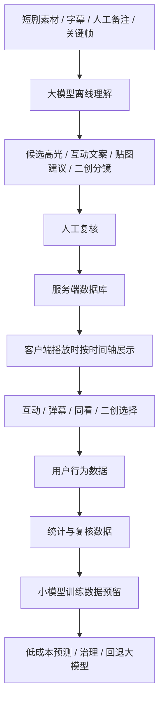
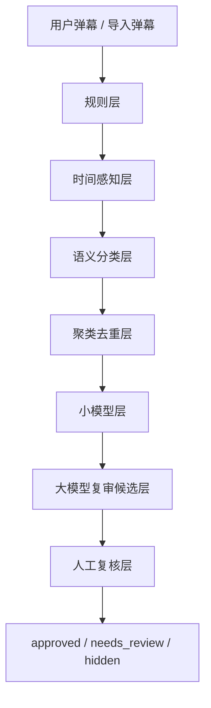
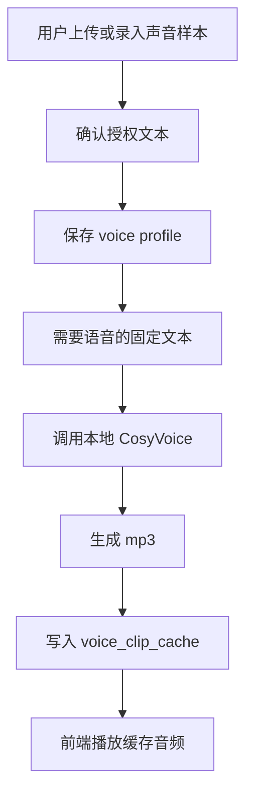

# 模型使用说明

更新时间：2026-06-11

## 文档定位

本文说明“半句”项目中大模型、小模型预留、弹幕治理、片尾 AI 二创和声音资产服务的职责边界。

当前原则：

- 不把大模型放在用户观看时的实时主链路上。
- 重要内容采用“离线生成 + 缓存 + 人工复核 + 服务端下发”。
- 小模型先服务低成本治理和后续训练预留，不抢当前 MVP 的稳定性。
- 所有真实密钥只放在本地 `.env`，不写入文档、日志和提交记录。

## 总体模型架构



## 大模型职责

大模型不是“在线陪用户实时聊天”的核心链路，而是内容理解和资产生产工具。

### 1. 高光标注

输入：

- 剧集基础信息。
- 分段时间轴。
- 字幕或台词。
- 画面备注。
- 音频情绪提示。
- 人工补充说明。

输出：

- 高光开始和结束时间。
- 高光名称。
- 高光类型。
- 情绪标签。
- 互动按钮文案。
- 标注理由。
- 证据文本。
- 置信度。

落库字段：

| 表 | 字段 |
| --- | --- |
| `highlights` | `start_time_sec`, `end_time_sec`, `title`, `highlight_type`, `emotion` |
| `highlights` | `options_json`, `source`, `confidence`, `model_version` |
| `highlights` | `annotation_reason`, `evidence_segment_ids_json`, `evidence_text` |

关键限制：

- 如果没有字幕、画面备注或人工上下文，不应让模型只靠剧名猜剧情。
- 大模型输出必须进入人工复核，再写回数据库。
- 一集短剧高光应保持稀疏，通常 3-5 个强峰值，不把每个情绪点都做成弹层。

相关脚本：

```powershell
.\.venv\Scripts\python.exe scripts\prepare_annotation_input.py --episode-id 1
.\.venv\Scripts\python.exe scripts\annotate_with_llm.py --input data\annotation_inputs\episode_1.json
.\.venv\Scripts\python.exe scripts\apply_annotations.py --file data\annotations\episode_1_llm.json --replace --source human_review
```

详细流程见 [annotation_pipeline.md](annotation_pipeline.md)。

### 1.1 全量高光表达与贴图策略升级

当前新增了一个批量升级链路，用于把已经存在的高光锚点升级成更适合展示的标题、描述、情绪、按钮和贴图时间窗。

相关脚本：

```powershell
.\.venv\Scripts\python.exe scripts\upgrade_highlights_and_stickers_with_llm.py
```

当前状态：

- 已批量处理 20 集。
- 65 个高光点保留原始触发时间，不让模型擅自改时间。
- 模型版本统一记录为 `highlight-sticker-upgrade-v1`。
- 20 条体验配置已写入 `episode_experience_configs`，状态为 `llm_draft`。
- 输出结果保存在 `data/llm_upgrades/episode_*_highlight_sticker_upgrade.json`。
- 汇总结果保存在 `data/llm_upgrades/summary_all.json`。

这个链路的作用不是重新发现高光，而是在已有锚点上做表达升级：

| 项目 | 是否允许模型修改 |
| --- | --- |
| 高光数量 | 不允许 |
| 高光触发时间 | 不允许 |
| 标题和描述 | 允许优化 |
| 高光类型和情绪 | 允许在分类体系内校正 |
| 互动按钮 | 允许优化短文案 |
| 贴图时间窗 | 允许生成建议 |
| 新剧情脑补 | 不允许，尤其是缺少字幕上下文的剧集 |

复核要求：

- 对缺少字幕和画面备注的剧集，只能当作表达草稿。
- 逐剧抽样检查高光文案、分类和贴图时间窗。
- 确认贴图不遮挡关键剧情、不剧透、不乱飞。
- 人工确认后再把 `llm_draft` 升级为正式复核状态。

### 2. 体验配置和贴图建议

大模型可根据剧集文本、高光点和剧情语气生成：

- 播放器主题建议。
- 高光贴图时间窗。
- 贴图文案和含义。
- 点击特效方向。
- 弹幕气质建议。

当前策略：

1. 模型先生成建议 JSON。
2. 复核页加载建议。
3. 人工选择、修改和合并。
4. 保存到 `episode_experience_configs.config_json`。

原因：

- 贴图如果时间不准，会遮挡剧情或破坏观感。
- AI 生成的贴图和动效需要人工判断是否贴近剧情。
- 体验配置按单集保存，便于《北往》《那年冬至》等重点剧逐集打磨。

### 3. 弹幕语义批量审核

真实弹幕量大，不适合每条实时调用大模型。当前建议大模型只用于离线批量审核或高风险样本复核。

适合交给大模型的任务：

- 判断是否剧透。
- 判断是否出戏。
- 判断是否低俗或攻击。
- 判断是否贴合当前剧情。
- 建议适合轻聊、狂欢还是沉浸。
- 对提前剧透弹幕给出建议后移时间。

相关脚本：

```powershell
.\.venv\Scripts\python.exe scripts\review_danmaku_with_llm.py --episode-id 3 --limit 40
```

默认可以 dry-run 看提示词。真实调用和写回需要显式参数，避免误操作。

### 4. 片尾 AI 二创

当前片尾二创不采用实时视频生成。原因：

- 视频生成成本高。
- 等待时间长。
- 风格稳定性不够。
- 比赛现场演示不能依赖不稳定任务。

当前采用稳定方案：

```text
主分支选择 -> 个性化选项 -> 预生成图片分镜 -> 点击翻页 -> 原版/用户声音播放
```

《北往》第一集已形成重点演示：

- 主分支 1：车坏在半路。
- 主分支 2：借钱买票回家。
- 主分支 3：帮人后一起回家。
- 每条主分支 3 个个性化选项。
- 每个选项 3 张图片分镜。
- 共 27 张图像分镜方案。

图片生成方式：

- 使用原剧截图作为人物和画风参考。
- 使用图像模型生成或编辑图片。
- 图片生成后缓存到 `frontend/assets/remix_images/`。
- 前端只读取已缓存资产，保证播放稳定。

相关文档：

- [BEIWANG_EP1_REMIX_27_PROMPTS.md](BEIWANG_EP1_REMIX_27_PROMPTS.md)
- [BEIWANG_EP1_REMIX_AUDIO_LINES.md](BEIWANG_EP1_REMIX_AUDIO_LINES.md)

### 5. 文案和分镜生成

`POST /api/episodes/{episode_id}/ai-remix` 会根据用户选择生成或读取二创内容。

当前逻辑：

- 如果对应图片资产已缓存，返回 `cached_images` 方案。
- 如果模型调用失败，使用本地 fallback 文案。
- 每次生成记录写入 `episode_ai_remixes`。
- 复核员可以把优质记录设为精选。

这样可以保证：

- 用户体验不被模型失败中断。
- AI 生成内容有记录。
- 展示内容可人工精选。

## 小模型预留

当前项目没有把高光识别小模型作为第一版上线依赖。原因很明确：训练数据还不足，先做高质量人工复核数据更重要。

### 当前已做的预留

| 方向 | 当前状态 |
| --- | --- |
| 高光二分类 | 数据字段已预留，训练尚未正式接入 |
| 高光类型多分类 | `highlight_type` 固定分类已建立 |
| 情绪分类 | `emotion` 字段已建立 |
| 互动模板推荐 | `options_json` 和体验配置已承载 |
| 低置信度回退大模型 | 架构上预留，暂未做自动调度 |
| 弹幕小模型 | 已有轻量 JSON 权重模型和训练函数预留 |

### 弹幕小模型当前形态

当前弹幕治理中有一个轻量小模型层：

- 模型文件：`data/danmaku_small_model.json`
- 模型版本：`danmaku-small-model-v1`
- 输入：弹幕文本。
- 输出：通过分 `pass_score`。
- 用途：辅助判断低质量、低相关或高风险弹幕。

它不是深度学习模型，而是基于审核结果训练出的轻量词权重模型。这样做的优点是：

- 成本低。
- 可解释。
- 不需要额外推理服务。
- 适合比赛 MVP 阶段展示“小模型层”的工程思想。

后续如果数据量足够，可以替换成：

- 文本分类模型。
- 轻量 Transformer。
- 向量召回 + 分类器。
- 多标签分类模型。

### 小模型训练数据来源

训练数据来自：

- 大模型标注结果。
- 人工复核高光。
- 弹幕治理结果。
- 人工修改的弹幕状态。
- 用户互动表现，例如点击率、选择分布、停留和复看。

优先训练顺序建议：

1. 弹幕低俗/剧透/不相关分类。
2. 高光类型分类。
3. 高光是否触发互动的二分类。
4. 互动模板推荐。
5. 个性化文案推荐。

## 弹幕治理

弹幕治理已从六层方案升级为七层治理展示，不依赖单一人工审核。



### 1. 规则层

处理最快、最便宜的问题：

- 空内容。
- 过长内容。
- 低俗攻击。
- 广告和联系方式。
- 明显剧透词。
- 纯符号或刷屏。

对应代码：

- `backend/app/danmaku_moderation.py`
- `backend/app/danmaku_governance.py`

### 2. 时间感知层

弹幕不能只看内容，还要看它出现在哪一秒。

例子：

- 《北往》第一集 4:30 左右才揭晓摩托车。
- 如果 4:00 前出现“骑摩托回家”，应拦截、复核或建议延后展示。

落库字段：

- `spoiler_score`
- `suggested_time_sec`
- `moderation_reason`
- `moderation_layers_json`

### 3. 语义分类层

判断弹幕是否：

- 贴合剧情。
- 只是站外打卡。
- 是演员粉丝无关讨论。
- 是情绪表达。
- 适合轻聊还是狂欢。

当前实现有本地语义规则；大模型语义审核作为离线增强脚本。

### 4. 聚类去重层

真实弹幕会大量重复，例如：

- 哈哈哈。
- 救命。
- 太甜了。
- 心疼她。

系统会生成 `cluster_key` 和 `cluster_size`，相似弹幕只需要审核代表样本。

价值：

- 降低人工复核量。
- 降低大模型调用成本。
- 保留弹幕热度，不把重复情绪全部删掉。

### 5. 小模型层

小模型输出 `pass_score`，辅助判断是否放行。

当前小模型同时输出：

- `pass_score`：通过倾向。
- `confidence`：模型自身置信度。
- `model_version`：模型版本。

它不是最终裁决，只是低成本辅助。低置信度、高风险、高热度内容会进入大模型复审候选或人工复核。

后台新增训练接口：

```text
POST /api/admin/episodes/{episode_id}/danmaku-governance/train-small-model
```

接口行为：

1. 基于当前 `danmaku_comments.review_status` 训练轻量词权重模型。
2. 写入 `data/danmaku_small_model.json`。
3. 对当前剧集重新执行弹幕治理。
4. 返回训练信息、重跑结果和模型文件路径。

### 6. 大模型复审候选层

这一层不会实时调用大模型，而是把适合离线复审的样本标记出来。

进入候选的典型情况：

- 规则风险中等。
- 疑似时间点剧透。
- 语义相关度偏低。
- 重复或高赞，但小模型置信度低。

对应治理字段：

- `moderation_layers_json.llm_review.candidate`
- `moderation_layers_json.llm_review.action`
- `moderation_layers_json.llm_review.issues`

复审模式记录为：

```text
offline_batch_queue
```

### 7. 人工复核层

人工只看三类内容：

- 模型不确定的。
- 高赞或高频弹幕。
- 可能剧透但系统拿不准的。

后台复核接口：

- `GET /api/admin/episodes/{episode_id}/danmaku-governance`
- `POST /api/admin/episodes/{episode_id}/danmaku-governance/run`
- `POST /api/admin/episodes/{episode_id}/danmaku-governance/train-small-model`
- `PATCH /api/admin/danmaku/{comment_id}`

后台治理摘要现在会返回：

- 每层命中数量。
- 重复弹幕组数。
- 大模型复审候选数量。
- 小模型版本、训练行数和更新时间。
- 小模型低置信度数量。

## 声音资产服务

声音资产服务的目标不是实时语音聊天，而是让用户授权一段声音样本后，系统可以为固定二创文本生成“我的声音带入版”。

### 当前流程



授权文本：

```text
同意利用录入声音生成音频
```

相关表：

- `voice_profiles`
- `voice_clip_cache`

相关接口：

- `GET /api/users/me/voice-profile`
- `POST /api/users/me/voice-profile`
- `POST /api/users/me/voice-clips`
- `POST /api/episodes/{episode_id}/remix-voice-clips`

### 原版声音和用户声音

片尾二创有两类声音：

| 模式 | 说明 |
| --- | --- |
| `original` | 使用剧中主角声音片段作为提示音，提前生成或缓存 |
| `user` | 使用用户授权声音样本作为提示音，生成用户声音带入版 |

注意：

- 原版声音和用户声音不能复用同一条音频。
- 同一页面切换时只能播放一段声音，避免重叠。
- 语音文本应短、连贯、适合 1.18 左右语速。
- 现场演示优先使用已缓存音频。

### 部署限制

当前 CosyVoice 是本地服务：

- 电脑端运行可用。
- 临时公网演示时，后端仍调用本机服务。
- 如果迁移到手机端，模型文件不应直接塞进普通 App；应由服务端统一生成和缓存。

生产化建议：

- 语音生成做成异步任务。
- 给用户提供删除声音样本和生成结果的入口。
- 增加授权协议和隐私说明。
- 明确禁止使用他人未授权声音。

## 模型配置

`.env` 中使用占位配置，不写真实值：

```text
ARK_API_KEY=
ARK_ENDPOINT_ID=
ARK_MODEL=
ARK_BASE_URL=https://ark.cn-beijing.volces.com/api/v3
OPENAI_API_KEY=
OPENAI_MODEL=
OPENAI_BASE_URL=https://api.openai.com/v1
COSYVOICE_BASE_URL=http://127.0.0.1:50001
```

说明：

- 高光标注和部分文本生成可使用 OpenAI 兼容 Chat Completions 接口。
- 图片生成脚本可使用图像模型接口。
- 声音生成使用本地 CosyVoice。
- 真实密钥只放本地 `.env`，不进入 Git。

## 复核与可追踪性

每类模型结果都需要留痕：

| 能力 | 留痕位置 |
| --- | --- |
| 高光标注 | `source`, `confidence`, `model_version`, `annotation_reason` |
| 弹幕治理 | `review_status`, `risk_score`, `moderation_model_version`, `moderation_layers_json` |
| 二创分镜 | `episode_ai_remixes`, `prompt_trace_json`, `review_status` |
| 声音生成 | `voice_clip_cache`, `model_version`, `source`, `status` |
| 体验配置 | `episode_experience_configs`, `source`, `model_version`, `review_status` |

这让答辩时可以讲清楚：

- 哪些是模型生成。
- 哪些经过人工复核。
- 哪些是缓存资产。
- 哪些还属于后续迭代。

## 当前边界

当前已经具备完整 MVP 模型闭环，但不是所有模型能力都生产化：

- 高光小模型尚未正式训练和部署。
- 视频生成不作为稳定交付能力。
- 弹幕小模型是轻量预留层，不是大规模审核系统。
- 声音服务依赖本地 CosyVoice，不是云端弹性服务。
- 生成图片和音频需要人工检查后再作为演示资产。
- 20 集高光与贴图策略升级目前是 `llm_draft`，仍需要逐剧人工抽检。
- 七层弹幕治理中的大模型复审层当前是候选队列，不是实时复审服务。

这个边界是有意设计的：先保证产品闭环和展示稳定，再逐步提高自动化程度。
