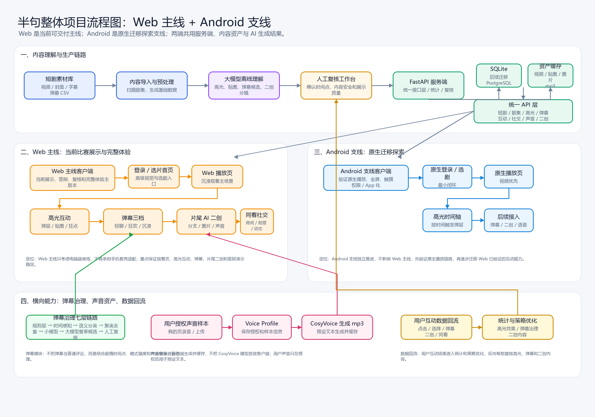
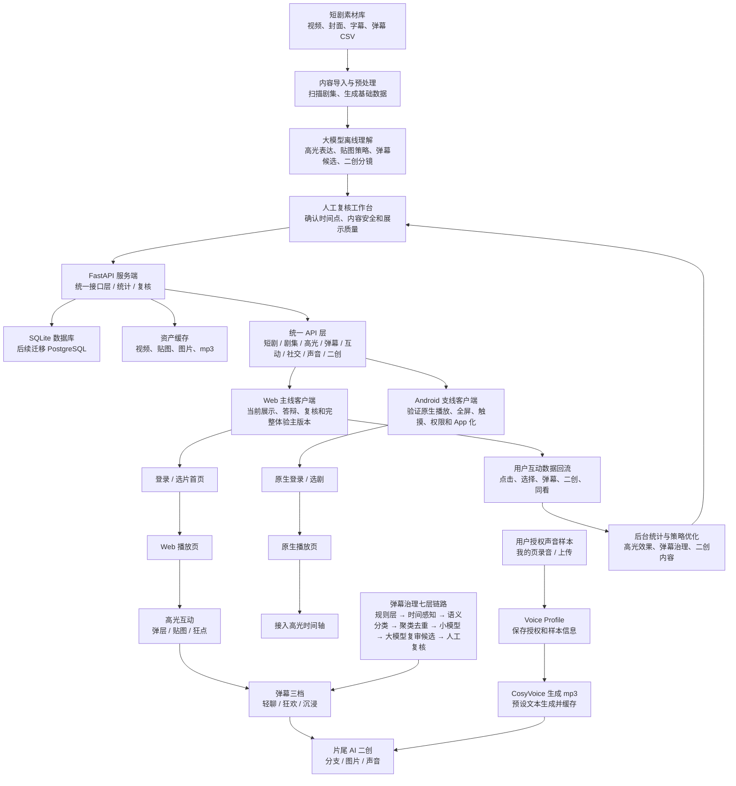

# 半句整体项目流程图：Web 主线 + Android 支线

> 飞书文档通常不会自动渲染 Mermaid。
> 如果直接粘贴 Mermaid 代码，飞书会把它显示成“代码块”。
> 推荐做法：在飞书中直接插入下面这张 PNG 图片。



## 飞书使用方法

1. 打开飞书文档。
2. 输入 `/图片`，或直接把 `docs/overall_flow_web_android_feishu.png` 拖进飞书文档。
3. 如果图片过大，点击图片后选择“适应页面宽度”。
4. Mermaid 代码只作为备份，不建议直接粘贴到飞书正文中。

## 图片文件位置

```text
docs/overall_flow_web_android_feishu.png
```

## Mermaid 备份版本


