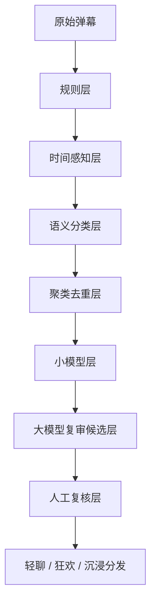

# 隐私与内容安全说明

更新时间：2026-06-11

## 文档目的

本文说明“半句”当前 Web 演示版涉及的用户数据、声音资产、AI 二创内容、弹幕和社交内容的处理边界。

当前版本主要用于比赛展示和本地/临时公网演示，不等同于正式上线版本。正式上线前必须补充完整用户协议、隐私政策、内容审核规则、删除入口和管理员审计能力。

## 当前数据分类

| 数据类型 | 当前用途 | 当前存储 | 风险级别 |
| --- | --- | --- | --- |
| 账号信息 | 登录、区分用户、好友和同看 | SQLite | 中 |
| 头像和昵称 | 个人页、好友、同看、动态展示 | SQLite + 本地资产 | 中 |
| 弹幕和评论 | 观看互动、社交讨论、治理演示 | SQLite | 中 |
| 高光互动行为 | 点击、选择、积分、徽章、统计 | SQLite | 中 |
| 好友和聊天消息 | 聊聊、邀请同看、演示社交关系 | SQLite | 中 |
| 动态内容 | 逛逛、点赞、评论、分享 AI 资产 | SQLite | 中 |
| 声音样本 | 创建 voice profile，用于生成预设台词音频 | 本地文件 + SQLite 记录 | 高 |
| 生成音频 | 片尾二创或陪看语音播放 | 本地文件缓存 | 高 |
| AI 二创图片/剧情卡 | 片尾拓展剧情展示 | 本地文件 + SQLite | 中 |
| 视频素材和封面 | 播放短剧、首页展示 | 本地文件 | 中 |

## 隐私处理原则

1. 最小化收集
   只收集当前功能需要的数据。演示版不要求真实手机号、身份证、定位、通讯录等敏感信息。

2. 明确授权
   声音样本必须由用户主动上传或录入，并配合授权文本，例如“同意利用录入声音生成音频”。

3. 本地优先
   当前演示数据主要保存在本机 SQLite 和本地资产目录中。除非显式启用模型 API 或公网隧道，否则不应上传到第三方服务。

4. 可替换和可删除
   头像、昵称、声音样本、生成音频、动态和评论后续必须提供替换和删除入口。当前演示版已经有部分产品入口，正式上线前需要补齐后端删除和审计逻辑。

5. 不写入密钥
   文档、Git 提交、前端代码、截图和答辩材料中不得出现 API Key、Bearer Token、模型接入点密钥或账号密码。

## 声音资产安全

声音是当前项目最高风险的数据类型，因为它可以用于生成近似用户声音的音频。

当前设计边界：

- 用户必须主动录入或上传声音样本。
- 授权文本固定为“同意利用录入声音生成音频”，用于证明用户知道该声音会被用于生成。
- 只为预设台词生成音频，不开放任意文本实时生成。
- 原版声音和用户声音带入版分开缓存，避免混用。
- 前端只播放生成结果，不直接暴露声音样本管理路径。

正式上线前必须补齐：

- 声音授权协议。
- 生成用途说明。
- 取消授权和删除声音样本入口。
- 删除后清理已生成音频缓存的策略。
- 防止他人上传非本人声音的声明和风控。
- 管理员可追踪生成记录，但不能随意下载用户原始声音样本。

## 头像、照片和用户形象

当前头像体系以系统头像池为主，用户上传和 AI 形象生成仍应保持谨慎。

当前原则：

- 默认使用系统头像，降低隐私和肖像风险。
- 用户上传头像只用于站内展示，不应默认公开到陌生人可见区域。
- 漂流瓶/逛逛等半公开场景只展示昵称、头像、称号，不暴露完整个人主页。

后续如果增加“用户照片带入剧情”或“生成 AI 动画形象”，必须新增：

- 照片上传授权。
- 肖像使用范围说明。
- 生成结果可删除入口。
- 未成年人和他人肖像保护规则。
- 禁止生成违法、色情、侮辱、冒充、诈骗用途的内容。

## 弹幕治理

弹幕治理采用七层方案，目标是降低人工审核成本，同时保证观看体验。

治理对象：

- 低俗辱骂。
- 广告和联系方式。
- 刷屏和无意义重复。
- 剧透内容。
- 与当前剧情无关的出戏内容。
- 诱导加好友、交易、引流等内容。
- 可能影响他人观看体验的攻击性表达。

关键策略：

- 明显违规内容由规则层快速拦截。
- 剧透不能只看文本，还要结合出现时间和剧情揭晓点。
- 大量重复弹幕先聚类，只审核代表弹幕。
- 小模型负责低成本初筛。
- 低置信度、高风险、高赞或推荐池内容进入大模型候选或人工复核。

## 社交内容安全

当前社交模块包括好友申请、聊天、同看房间、动态、评论和点赞。

当前规则：

- 好友关系需要申请和接受，不建议直接互加。
- 动态可以支持公开、朋友可见、仅自己可见等权限方向。
- 漂流瓶/公开动态允许陌生人评论，但不展示完整个人主页。
- 发布者应能删除自己动态下的评论。
- 禁止淫秽低俗、辱骂、人身攻击、诈骗、联系方式引流和违法内容。

正式上线前需要补齐：

- 举报入口。
- 评论删除和拉黑。
- 管理员处理后台。
- 内容审核记录。
- 用户封禁和申诉机制。
- 未成年人保护规则。

## AI 二创内容声明

片尾 AI 二创是基于原短剧剧情的拓展想象，用于提升观看后的参与感。当前版本采用预生成图片、剧情卡和音频缓存。

必须向用户说明：

- 二创内容不是原剧官方剧情。
- 图片、剧情卡和声音可能由 AI 生成或辅助生成。
- 用户声音带入版只用于用户授权后的预设台词播放。
- 二创内容不得用于冒充真人、造谣、诈骗、色情低俗或侵权传播。

内容边界：

- 不生成涉及违法、色情、血腥、仇恨、未成年人不当内容。
- 不生成对真实人物的恶意冒充。
- 不生成包含个人隐私、联系方式、真实地址等内容。
- 不把用户上传的声音或照片默认公开分享。

## 模型调用安全

当前项目可能使用大模型、图片生成模型和本地声音服务。

安全要求：

- API Key 只放在 `.env` 或本地安全配置中。
- 日志只输出脱敏状态，不输出完整密钥。
- 批量生成任务优先离线执行，避免用户实时等待和成本失控。
- 模型输出进入 `llm_draft` 或候选状态，关键内容必须人工复核。
- 不把用户声音样本、照片或敏感聊天内容无说明地发送给外部模型。

## 演示版和正式上线版差异

| 项目 | 当前演示版 | 正式上线前要求 |
| --- | --- | --- |
| 数据库 | SQLite | PostgreSQL、备份、迁移脚本 |
| 文件存储 | 本地文件 | 对象存储、权限隔离、生命周期管理 |
| 登录 | 演示账号和基础身份 | 密码安全、验证码、会话过期、风控 |
| 声音授权 | 产品雏形 | 完整授权协议、删除入口、审计 |
| 内容审核 | 七层治理雏形 | 审核后台、举报、封禁、申诉 |
| 日志 | 本地运行记录 | 脱敏日志、访问审计、异常告警 |
| 公网访问 | 临时隧道 | 域名、HTTPS、防火墙、监控 |

## 当前必须遵守的红线

- 不在 Git、文档、截图或聊天回复中泄露 API Key。
- 不公开用户声音样本和生成音频的原始路径。
- 不把用户声音、照片、聊天、评论默认作为公开素材。
- 不让 AI 二创内容伪装成原剧官方剧情。
- 不让弹幕和评论绕过治理直接进入推荐池。

## 下一步建议

1. 给“我的-声音资产”补删除和重新授权入口。
2. 给动态和评论补举报、删除、拉黑和权限展示。
3. 给复核页补内容风险标签：低俗、剧透、广告、出戏、侵权风险。
4. 给 AI 二创入口补“AI 生成内容”轻提示。
5. 正式部署前补 `PRODUCTION_PLAN.md`，明确数据库、对象存储、HTTPS、备份和监控方案。
