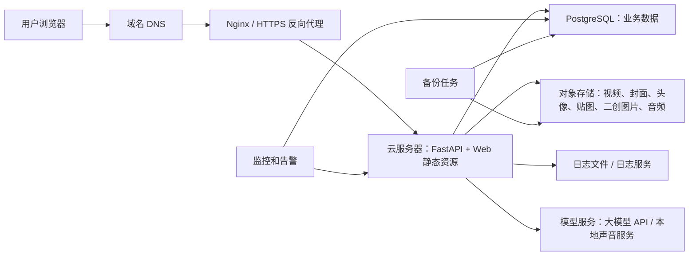
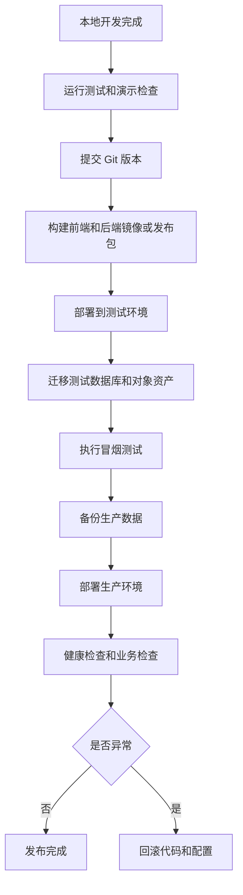

# 正式上线迁移方案

更新时间：2026-06-11

## 目标

把当前本地 Web 演示版迁移为可公网访问、可备份、可监控、可继续迭代的第一版线上系统。

第一版上线不追求复杂微服务。优先保证：

- 用户能稳定访问 Web 客户端。
- 视频、封面、头像、贴图、二创图片和音频能稳定加载。
- 数据不再只依赖本机 SQLite。
- API Key、声音样本、用户数据有基础隔离。
- 出问题时能回滚、能查日志、能恢复数据。

## 当前状态

当前项目运行方式：

- 服务端：FastAPI。
- 客户端：电脑端 Web。
- 数据库：SQLite，本地文件 `data/app.db`。
- 文件资产：本地视频、封面、头像、贴图、AI 二创图片、声音缓存。
- 公网演示：临时隧道。
- 模型调用：以离线批处理和缓存资产为主。
- 声音服务：本地 CosyVoice 服务，生成结果缓存为音频文件。

当前方式适合本地演示，不适合正式多人访问。主要风险是：数据库单点在本机、文件路径依赖本地目录、临时隧道不稳定、没有正式 HTTPS、没有备份和监控。

## 第一版生产架构

推荐第一版使用“单应用服务器 + PostgreSQL + 对象存储 + HTTPS”的结构。



第一版不建议马上拆成多个服务。理由：

- 当前功能仍在快速变化，拆太细会增加联调成本。
- 比赛展示更需要稳定访问和快速迭代。
- FastAPI + Web 静态资源部署在同一台云服务器，问题定位最简单。
- PostgreSQL 和对象存储独立出来后，最重要的数据安全问题已经解决。

## 云服务器

第一版建议：

| 项目 | 建议 |
| --- | --- |
| 系统 | Linux 服务器 |
| 部署内容 | FastAPI、前端静态资源、Nginx、定时任务、日志 |
| 运行方式 | systemd 或 Docker Compose 二选一 |
| 推荐策略 | 优先 Docker Compose，便于迁移和回滚 |
| 防火墙 | 只开放 80、443、必要的 SSH 端口 |
| 密钥 | `.env` 保存在服务器本地，不进 Git |

部署形态：

```text
Nginx
  ├─ /              -> frontend 静态页面
  ├─ /api/*         -> FastAPI
  ├─ /media/*       -> 对象存储签名地址或静态代理
  └─ /docs          -> 可按环境决定是否开放

FastAPI
  ├─ 读取 PostgreSQL
  ├─ 读写对象存储
  ├─ 调用模型 API
  └─ 写入应用日志
```

## 域名和 HTTPS

正式访问必须使用 HTTPS，原因：

- 麦克风录音需要安全上下文。
- 用户登录、声音样本、头像和聊天内容不能明文传输。
- 浏览器对媒体播放、权限调用和跨域策略更稳定。

上线步骤：

1. 准备域名。
2. DNS 指向云服务器公网 IP。
3. Nginx 配置站点。
4. 申请 HTTPS 证书。
5. 强制 HTTP 跳转 HTTPS。
6. 配置安全响应头。

建议响应头：

```text
Strict-Transport-Security
X-Content-Type-Options
X-Frame-Options
Referrer-Policy
Content-Security-Policy
```

第一版 CSP 不要过严，避免影响视频、图片和模型资产加载；上线稳定后再收紧。

## PostgreSQL 迁移方案

### 目标

把当前 SQLite 的业务数据迁移到 PostgreSQL，避免正式环境依赖本机单文件数据库。

### 迁移范围

需要迁移：

- 用户、头像、昵称、角色。
- 短剧、剧集、封面、视频地址。
- 高光点、互动模板、体验配置、模型来源和复核状态。
- 弹幕、弹幕治理结果、小模型元数据。
- 同看房间、好友、聊天、动态、评论点赞。
- 片尾 AI 二创配置、精选内容、用户选择记录。
- 声音 profile、生成音频缓存记录。
- 徽章、称号、积分和观看战报。

不建议迁移到数据库的大文件：

- 视频文件。
- 封面原图。
- 头像原图。
- 贴图、二创图片。
- mp3 音频。
- 原始声音样本。

这些文件应迁移到对象存储，数据库只保存对象 key、URL、hash、大小、创建时间和权限。

### 迁移步骤

1. 梳理当前 SQLite 表结构
   输出当前表、字段、索引、外键和 JSON 字段。

2. 建立 PostgreSQL schema
   优先保持字段语义不变，避免迁移时顺手重构业务。

3. 修改数据库访问层
   当前如果存在 SQLite 专用语法，需要抽出统一连接配置，并适配 PostgreSQL 参数占位符、时间字段和 JSON 字段。

4. 编写迁移脚本
   从 `data/app.db` 读取数据，写入 PostgreSQL。每张表迁移后输出数量对账。

5. 本地演练
   用复制出来的 SQLite 数据库做迁移，不直接操作唯一原库。

6. 启动测试环境
   FastAPI 指向 PostgreSQL，跑首页、播放页、复核页、弹幕、二创、声音资产等关键路径。

7. 冻结正式迁移窗口
   停止写入 SQLite，导出最终数据，执行迁移。

8. 切换生产环境
   `.env` 中把数据库连接改为 PostgreSQL。

9. 保留回滚窗口
   保留迁移前 SQLite、对象存储上传清单和旧版本代码。

### 验收标准

- `/api/health` 正常。
- `/api/dramas` 数量与迁移前一致。
- 20 集剧集数据可读取。
- 北往第一集可播放。
- 高光、弹幕、贴图、二创、声音缓存路径正常。
- 复核页能读取并保存配置。
- 互动上报写入 PostgreSQL。
- 随机抽查 3 部剧，每部至少 1 集数据完整。

## 对象存储迁移方案

### 目标

把本地文件资产迁移到对象存储，解决正式访问时本地路径不可用、服务器磁盘膨胀和资产备份困难的问题。

### 资产分类

| 分类 | 示例 | 访问权限 |
| --- | --- | --- |
| 视频 | 剧集 mp4 | 公开读或签名读 |
| 封面 | 短剧封面 png/jpg | 公开读 |
| 系统贴图 | 高光贴纸、徽章、Q 版图标 | 公开读 |
| 二创图片 | 片尾 AI 分镜图 | 公开读或登录后读 |
| 用户头像 | 用户上传头像 | 登录后读或有限公开 |
| 声音样本 | 用户授权录音 | 私有 |
| 生成音频 | 用户声音带入版 mp3 | 登录后读或签名读 |
| 备份文件 | 数据库备份、导出包 | 私有 |

### 对象 key 建议

```text
videos/{drama_id}/{episode_id}.mp4
covers/{drama_id}/cover.png
stickers/{theme}/{asset_name}.svg
remix/{episode_id}/{branch_id}/{scene_id}.png
avatars/{user_id}/{asset_hash}.png
voice_profiles/{user_id}/{profile_id}/sample.wav
voice_cache/{user_id}/{profile_id}/{text_hash}.mp3
backups/postgres/{yyyy-mm-dd}/backup.sql.gz
```

### 迁移步骤

1. 生成本地资产清单：路径、大小、hash、业务归属。
2. 上传到对象存储。
3. 写回数据库对象 key。
4. 前端和接口统一使用资产 URL，不再依赖本地绝对路径。
5. 私有资产使用签名 URL 或后端代理。
6. 删除前先保留本地资产备份，确认线上稳定后再清理。

## 备份方案

### PostgreSQL 备份

第一版备份策略：

- 每日全量备份。
- 备份文件压缩后上传对象存储私有桶。
- 至少保留最近 7 天每日备份。
- 每周保留一个长期备份，至少保留 4 周。
- 重要演示或上线前手动备份一次。

备份内容：

- PostgreSQL 数据。
- 数据库 schema。
- 迁移版本号。
- 备份时间。
- 代码版本号或 Git commit。

### 对象存储备份

对象存储不等于备份。需要：

- 开启版本控制，防止误删覆盖。
- 对用户声音样本和生成音频设置更严格权限。
- 定期导出资产清单。
- 数据库备份和对象 key 要能互相对账。

### 恢复演练

至少做一次恢复演练：

1. 新建空数据库。
2. 用最近一次备份恢复。
3. 指向同一套对象存储测试环境。
4. 打开首页、播放页、复核页。
5. 验证北往第一集、弹幕、二创和声音缓存。

## 监控和日志

### 应用监控

第一版至少监控：

- 服务是否存活。
- API 响应时间。
- 5xx 错误数量。
- 登录失败和接口异常。
- 视频和对象存储资源加载失败。
- 模型调用失败。
- 声音生成失败。
- 数据库连接失败。

### 系统监控

至少监控：

- CPU。
- 内存。
- 磁盘。
- 网络流量。
- Nginx 访问日志和错误日志。
- FastAPI 应用日志。

### 业务监控

用于判断产品是否正常：

- 每日访问人数。
- 每集播放次数。
- 高光触发次数。
- 高光点击率。
- 弹幕发送量。
- 片尾二创进入率。
- 声音生成成功率。
- 同看房间创建数。

### 日志原则

- 不记录完整 API Key。
- 不记录完整声音样本路径。
- 不记录用户密码明文。
- 不在日志中输出用户上传照片或声音的真实下载地址。
- 错误日志保留 request id，方便定位。

## 模型和声音服务部署

### 大模型

建议继续采用离线批处理：

- 高光表达升级。
- 贴图策略升级。
- 弹幕复审候选批量处理。
- 片尾二创文案和图片提示词生成。

不建议第一版上线时对每条弹幕或每次用户点击实时调用大模型。

### 图片生成

建议采用“预生成 + 精选 + 缓存”：

- 重点剧集提前生成图片资产。
- 复核页选择可展示内容。
- 前端只加载缓存结果。

### 声音服务

当前声音能力可以继续作为服务端能力，不需要放到手机或浏览器端。

第一版策略：

- 用户上传或录入声音样本。
- 后端创建 voice profile。
- 对预设文本生成 mp3。
- 生成结果缓存。
- 再次播放直接读取缓存。

上线前必须确认：

- 声音授权文本明确。
- 用户可删除声音 profile。
- 私有声音样本不公开访问。
- 生成音频有权限控制。

## 环境变量和密钥

生产环境 `.env` 至少需要：

```text
APP_ENV=production
APP_BASE_URL=https://example.com
DATABASE_URL=postgresql://...
OBJECT_STORAGE_ENDPOINT=...
OBJECT_STORAGE_BUCKET=...
OBJECT_STORAGE_ACCESS_KEY=...
OBJECT_STORAGE_SECRET_KEY=...
MODEL_PROVIDER=...
MODEL_API_KEY=...
VOICE_SERVICE_URL=...
SECRET_KEY=...
```

要求：

- `.env` 不进入 Git。
- 服务器密钥只给部署用户可读。
- 日志不打印密钥。
- 密钥定期轮换。
- 临时测试 key 和生产 key 分开。

## 发布流程



第一版冒烟测试清单：

- 首页可打开。
- 登录成功。
- 短剧列表加载。
- 北往第一集可播放。
- 高光弹层触发。
- 弹幕可显示。
- 片尾二创可进入。
- 图片分镜可翻页。
- 原版声音和用户声音入口不串音。
- 复核页可读取。
- 管理页统计可打开。

## 回滚方案

上线前必须准备：

- 上一个可用 Git 版本。
- 上一个 `.env` 配置备份。
- PostgreSQL 上线前备份。
- 对象存储上传清单。
- Nginx 配置备份。

回滚顺序：

1. 停止新版本服务。
2. 切回旧版本代码或镜像。
3. 恢复旧 `.env`。
4. 重启服务。
5. 如果数据库已发生不兼容写入，恢复上线前备份。
6. 验证首页、播放页和 API。

第一版要避免不可逆数据库迁移。任何破坏性 schema 变更都应先备份并单独演练。

## 项目贴合度复核

本计划不是“现在立刻部署”的执行清单，而是给半句项目后续产品化预留路线。结合当前项目状态，最合理的判断如下：

| 判断项 | 当前项目状态 | 规划结论 |
| --- | --- | --- |
| 客户端形态 | 当前电脑端 Web 体验最完整，Android 原生探索尚未达标 | 继续以 Web 主线作为展示和迭代核心，原生客户端后置 |
| 内容规模 | 已有 10 部剧、每部前 2 集，重点体验集中在北往、那年冬至等样例 | 先打磨 2-4 部重点剧，再扩展到 20 集全量一致体验 |
| AI 高光能力 | 已完成 20 集 LLM 高光表达和贴图策略升级，但仍是 `llm_draft` | 保持人工复核入口，避免 AI 草稿直接上线 |
| 弹幕治理 | 已有七层治理思路和小模型雏形 | 后续重点是复核效率、时间感知剧透治理和演示可解释性 |
| 片尾二创 | 北往第一集流程最完整，采用图片分镜和声音缓存 | 不追求实时视频生成，先做高质量缓存式二创 |
| 声音资产 | 已接入声音样本、voice profile 和 mp3 缓存思路 | 正式开放前必须先补授权、删除和权限控制 |
| 社交同看 | 已有好友、聊天、同看、动态方向 | 先作为演示亮点，不急着做大规模实时消息系统 |
| 数据库 | SQLite 适合当前本地演示 | 真正部署前再迁移 PostgreSQL，不提前增加开发负担 |
| 文件资产 | 本地视频、贴图、二创图片和音频较多 | 未来必须对象存储化，否则公网访问和备份会失控 |

因此，短期目标不应是“马上部署生产环境”，而是把当前 Web 版本整理成稳定、可展示、可复核、可扩展的产品底座。

## 未来路线分层

### A 阶段：展示稳定期

目标：让电脑端 Web 版本在比赛和演示中稳定、好看、可讲清楚。

重点任务：

- 继续打磨播放页沉浸体验：控制栏、全屏、高光弹层、贴图动效、片尾入口。
- 重点优化北往第一集和那年冬至第一集，形成两个题材差异明显的样板。
- 保证弹幕三档模式稳定，弹幕不遮挡核心剧情。
- 让小半陪看和片尾战报只做轻提示，不喧宾夺主。
- 片尾 AI 二创使用缓存图片和缓存语音，避免演示现场等待生成。
- 每次演示前使用 `DEMO_CHECKLIST.md` 逐项检查。

不做：

- 不迁移数据库。
- 不接真实支付、短信、复杂推荐。
- 不做实时视频生成。
- 不做复杂原生客户端。

验收：

- 重点剧集从首页进入播放页流畅。
- 北往第一集完整播放、互动、二创流程可稳定演示。
- 复核页能解释高光来源、贴图窗、弹幕治理和二创精选。

### B 阶段：内容规模化期

目标：把体验从少数样板集扩展到更多剧集，而不是每集都手工堆效果。

重点任务：

- 对 20 集 LLM 草稿做人工抽检和必要修正。
- 建立高光稀疏原则：每集只保留 3-5 个强情绪点。
- 给每部剧建立主题播放器元素，例如北往的归家路线、那年冬至的冬日恋爱氛围。
- 贴图素材按剧集题材归类，避免同一批贴图到处复用。
- 建立二创内容优先级：只为最适合展示的剧集制作高质量二创。

不做：

- 不要求 20 集全部拥有同等复杂的二创。
- 不把模型草稿直接当最终内容。

验收：

- 至少 4 部剧各有明显不同的观看风格。
- 20 集基础高光和弹幕流程都能跑通。
- 重点剧集有人工确认过的体验配置。

### C 阶段：治理和后台产品化期

目标：让“AI + 人工复核”不是口号，而是可操作的后台流程。

重点任务：

- 复核页继续收敛：按剧集、内容类型、风险等级筛选。
- 弹幕治理显示七层结果：规则、时间、语义、聚类、小模型、LLM 候选、人工结果。
- 低置信度内容进入人工复核队列。
- 高赞弹幕、推荐弹幕、二创精选必须可人工确认。
- 增加操作日志，记录谁改了什么内容。

不做：

- 不做全量人工审核。
- 不把所有用户实时内容都交给大模型。

验收：

- 答辩时可以清楚演示一条弹幕从导入到治理再到展示的过程。
- 可以解释某个高光为什么触发、来源是什么、是否人工复核。

### D 阶段：受控公网体验期

目标：让少量外部用户能访问，但仍然是受控测试，不是正式大规模上线。

重点任务：

- 使用临时公网或测试域名开放 Web。
- 对视频、封面、贴图、二创图片和音频做资产路径整理。
- 限制注册或使用演示账号，避免不可控内容涌入。
- 记录访问日志和错误日志。
- 准备基础备份。

不做：

- 不公开大规模注册。
- 不开放任意 AI 声音文本生成。
- 不开放未经审核的公开动态推荐。

验收：

- 不在同一局域网的人能打开。
- 重点链路可用。
- 出现问题可以回到本地演示版本。

### E 阶段：准生产迁移期

目标：当确认要长期运行时，再进入真正生产化。

重点任务：

- SQLite 迁移 PostgreSQL。
- 本地文件迁移对象存储。
- 配置 HTTPS、Nginx、备份、监控和回滚。
- 声音样本、生成音频、头像、动态内容做权限隔离。
- 补齐隐私协议、内容安全、删除入口和举报机制。

验收：

- 数据库可备份可恢复。
- 对象存储资产可对账。
- 线上错误可监控。
- 用户数据可删除。

## 模块优先级路线

| 模块 | 短期 | 中期 | 长期 |
| --- | --- | --- | --- |
| 播放体验 | 电脑端 Web 继续打磨 | 多剧主题播放器 | 原生或跨端客户端 |
| 高光互动 | 重点剧集人工确认 | 20 集体验配置稳定 | 小模型辅助预测 |
| 弹幕治理 | 七层流程可演示 | 小模型和复核页联动 | 规模化审核后台 |
| 片尾二创 | 北往样板做精 | 扩展到 2-4 部重点剧 | 可配置二创生产流水线 |
| 声音资产 | 预设文本缓存播放 | 授权、删除、权限控制 | 用户声音资产体系 |
| 社交同看 | 演示好友/同看/动态 | 真实通知和权限 | 实时房间和推荐社区 |
| 数据存储 | SQLite 本地演示 | PostgreSQL 测试迁移 | 生产数据库和备份 |
| 文件资产 | 本地文件 | 对象存储试迁移 | CDN、权限和生命周期 |
| 安全合规 | 文档边界说明 | 删除、举报、审核 | 完整合规体系 |

## 决策门槛

只有满足以下条件，才建议从“计划”进入“真实部署”：

1. 重点演示剧集体验稳定，不再频繁大改播放逻辑。
2. 高光、弹幕、二创、声音和社交的数据结构基本稳定。
3. 至少完成一次本地备份和恢复演练。
4. 声音授权、用户删除、内容举报的产品边界已经明确。
5. 有明确的外部测试对象和测试周期。
6. 能接受部署后产生的运维成本，包括服务器、对象存储、监控和安全维护。

如果这些条件不满足，继续打磨 Web 主线更合理。

## 分阶段计划

### 阶段 1：生产化准备

目标：保留本地可运行状态，同时让代码支持生产配置。

任务：

- 抽象数据库连接配置。
- 增加 PostgreSQL 连接支持。
- 增加对象存储配置。
- 统一资产 URL 生成。
- 补健康检查接口。
- 补生产环境 `.env.example`。

验收：

- 本地 SQLite 仍可运行。
- PostgreSQL 测试库可运行。
- 前端资源路径不依赖本机绝对路径。

### 阶段 2：数据和资产迁移

目标：把演示数据迁到 PostgreSQL 和对象存储。

任务：

- 编写 SQLite 到 PostgreSQL 迁移脚本。
- 编写本地资产上传脚本。
- 建立对象 key 和数据库记录映射。
- 迁移后做数量对账。

验收：

- 20 集内容可读取。
- 视频、封面、贴图、二创图片、音频可加载。
- 复核页能读写。

### 阶段 3：云服务器部署

目标：让系统通过正式域名 HTTPS 访问。

任务：

- 配置云服务器。
- 部署 Nginx。
- 部署 FastAPI。
- 配置 HTTPS。
- 配置防火墙。
- 配置日志目录。

验收：

- 域名访问正常。
- API 正常。
- 麦克风权限可用。
- 视频播放和全屏正常。

### 阶段 4：备份和监控

目标：上线后能发现问题、恢复数据。

任务：

- 配置 PostgreSQL 每日备份。
- 配置对象存储版本控制。
- 配置应用日志轮转。
- 配置服务存活监控。
- 配置错误告警。

验收：

- 可以从备份恢复测试库。
- 服务异常能触发告警。
- 日志不包含敏感密钥。

### 阶段 5：灰度和正式开放

目标：先小范围验证，再扩大访问。

任务：

- 先给内部测试用户访问。
- 检查播放、弹幕、二创、声音、同看。
- 修复关键问题。
- 再扩大到比赛展示或外部体验。

验收：

- 连续演示 30 分钟无服务中断。
- 关键链路无 5xx。
- 数据写入正常。
- 可随时回滚。

## 第一版不做的事情

为了降低上线风险，第一版不建议做：

- 全量微服务拆分。
- 实时视频生成。
- 每条弹幕实时大模型审核。
- 把声音模型放进手机客户端。
- 复杂推荐系统。
- 多地区容灾。
- 自动弹性扩缩容。

这些能力可以后续逐步补，但不应阻塞第一版正式访问。

## 下一步开发任务

1. 增加 PostgreSQL 配置支持，保留 SQLite 作为本地开发模式。
2. 编写 SQLite 到 PostgreSQL 的迁移脚本。
3. 编写本地资产到对象存储的上传和回写脚本。
4. 增加生产环境 Nginx 配置样例。
5. 增加备份和恢复脚本。
6. 增加健康检查和基础监控指标。
