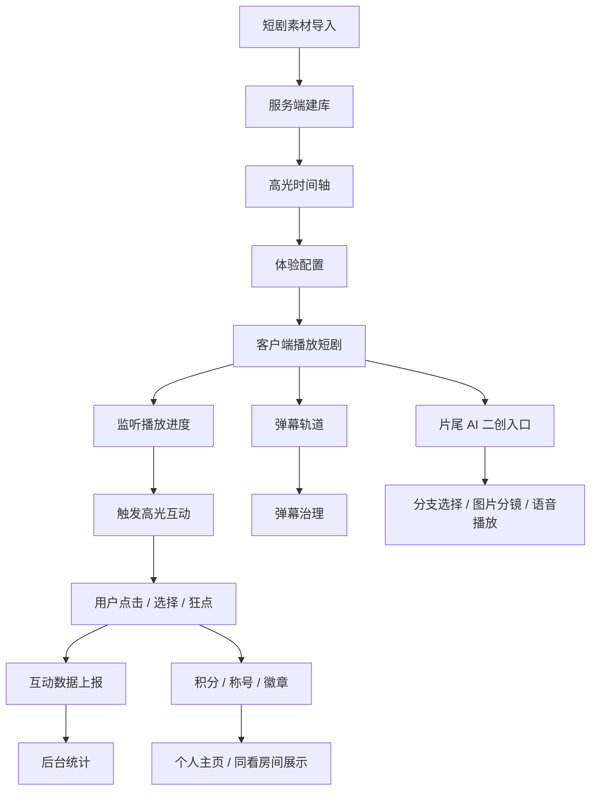

# 项目交付总说明

## 项目名称

半句：基于短剧剧情理解的即时互动激发系统

“半句”的含义是短剧陪伴。用户不需要打完整评论，只用半句话、一次点击、一次选择，就能在剧情高光时表达情绪。

## 一句话定义

这是一个面向短剧观看场景的 AI 互动系统：服务端理解并管理短剧高光时间轴，客户端在用户观看到关键剧情时自动触发低门槛互动，并把互动、弹幕、同看、二创和用户成长沉淀成可持续迭代的产品闭环。

## 真实问题

短剧用户在反转、冲突、甜蜜、虐心、搞笑、悬念等高光时刻有强烈表达欲，但传统弹幕和评论需要打字，会打断观看体验，也很难和剧情节奏精确对齐。

本项目要解决的是：

- 让用户在剧情最有情绪的位置低成本表达。
- 让平台知道每个高光点是否真正激发互动。
- 让运营/创作者能复核高光、配置互动和观察效果。
- 让 AI 能参与高光标注、弹幕治理、片尾二创和声音资产生成。

## 当前版本定位

当前版本以电脑端 Web 展示为主，服务端和客户端都已具备可演示闭环。Android 原生迁移曾做过尝试，但当前主线优先保证 Web 端展示质量。

当前版本不是纯 Demo，已经包含真实服务端、数据库、登录、播放、互动、弹幕、同看、社交、声音资产和片尾 AI 二创等模块。部分 AI 生成能力采用“离线生成 + 缓存 + 人工复核”的产品策略，避免实时生成成本和不稳定性影响演示。

## 核心闭环



## 已完成能力

### 基础播放与高光互动

- 短剧列表和选片首页。
- 真实视频播放。
- 剧集数据由服务端下发。
- 高光点按时间触发。
- 高光类型包括冲突对抗、反转揭秘、爽点逆袭、甜蜜心动、虐心共情、悬念钩子、搞笑解压、危机紧张。
- 不同高光有不同互动样式和动效。
- 互动结果上报到服务端。

### 播放体验

- 电脑端沉浸式观看页。
- 顶部导航弱化，视频优先。
- 播放控制栏支持空闲隐藏、进度提示、全屏。
- 北往第一集有定制播放器视觉、进度终点“家”符号和 Q 版进度标记。
- 高光弹层已做安全区处理，避免遮挡画面中心。
- 片尾 AI 二创入口在正片结束后出现，不和最后一个高光抢展示时机。

### 弹幕系统

- 三档弹幕模式：轻聊、狂欢、沉浸。
- 支持弹幕样式调整。
- 支持弹幕点击、点赞和回复。
- 导入弹幕数据后可进入治理流程。
- 弹幕治理采用七层思路：规则、时间感知、语义分类、聚类去重、小模型、大模型复审候选、人工复核。
- 后台可展示各治理层命中数量、小模型版本、训练行数和大模型复审候选数量。
- 已新增轻量小模型训练接口，可基于当前弹幕复核结果重新训练并重跑单集治理。

### 登录与用户成长

- 用户注册/登录。
- 头像和昵称管理。
- 头像池、分类、搜索、裁剪上传。
- 观看历史。
- 积分、称号、徽章。
- 个人主页和勋章展馆。

### 同看与社交

- 好友申请、接受、拒绝、撤回和历史记录。
- 好友聊天。
- 同看房间创建、加入、邀请。
- 房间成员、称号、徽章、答题结果和动态事件展示。
- 演示模式可注入社交事件，方便答辩时稳定展示。
- “聊聊”和“逛逛”入口。
- 逛逛动态流支持文字感受、AI 图片、AI 声音、AI 剧情卡等资产类型预留。

### 片尾 AI 二创

- 北往第一集已形成重点展示链路。
- 片尾提供三条主分支：车坏在半路、借钱买票回家、帮人后一起回家。
- 每条分支支持 3 个个性化选择，形成 27 种图像分镜组合。
- 图片分镜采用点击进入下一张的交互方式。
- 支持原版语音和用户声音带入版的播放入口。
- 语音结果采用缓存策略，避免每次重新生成。

### 陪看智能人与片尾战报

- 播放中新增固定 AI 陪看员“小半”。
- “小半”会在高光前后给出轻量提示，避免用户错过关键情绪点。
- 单集播放过程中记录点击、选择和奖励，片尾可生成观看战报。
- 片尾战报中预留“小半”形象展示，当前包含 3D 形象和灵动眼睛两种展示模式。

### 声音资产服务

- 个人主页上传声音样本。
- 同意文本为“同意利用录入声音生成音频”。
- 后端保存 voice profile。
- 片尾 AI 二创和陪看小助手可复用该声音生成 mp3。
- 使用本地 CosyVoice 服务时，可生成并缓存语音片段。

### 后台与复核

- 后台统计互动数据。
- 复核页可编辑高光时间、标题、类型、选项和体验配置。
- 支持贴图时间窗新增/删除、素材预览、按高光生成贴图窗。
- 支持片尾二创精选内容编辑。
- 支持弹幕治理列表和审核状态。
- 支持 20 集高光表达与贴图策略的 LLM 批量升级结果复核。
- 批量升级结果输出到 `data/llm_upgrades/`，便于抽检和回溯。

## 技术架构

### 前端

- 原生 HTML/CSS/JavaScript。
- 当前主线以电脑端 Web 展示为主。
- 同一页面内承载登录、首页、播放、聊聊、逛逛、我的、统计、复核等视图。

### 服务端

- FastAPI。
- 提供短剧、剧集、高光、弹幕、互动、用户、好友、同看、社交、二创、声音资产、后台复核等接口。

### 数据库

- SQLite。
- 默认路径由 `DATABASE_URL` 配置。
- 本地开发和比赛演示足够使用。
- 后续上线可迁移到 PostgreSQL。

### AI 相关

- 大模型用于高光标注、互动文案、贴图建议、片尾剧情二创。
- 大模型批量升级链路已处理 20 集高光表达和贴图时间窗，生成 `highlight-sticker-upgrade-v1` 草稿。
- 弹幕治理当前具备规则层、时间层、语义层、聚类层、小模型层、大模型复审候选层和人工复核层。
- 声音资产使用本地 CosyVoice 接口。
- 图像/视频生成策略当前以图片分镜和缓存资产为主，暂不依赖实时视频生成。

## 本地运行

1. 准备 Python 虚拟环境和依赖。

2. 配置 `.env`，可参考 [.env.example](../.env.example)。不要把真实密钥写入文档或提交。

3. 启动服务：

```powershell
.\.venv\Scripts\python.exe -m uvicorn backend.app.main:app --reload --host 127.0.0.1 --port 8000
```

4. 打开：

- 客户端：[http://127.0.0.1:8000/](http://127.0.0.1:8000/)
- 统计页：[http://127.0.0.1:8000/#admin](http://127.0.0.1:8000/#admin)
- 复核页：[http://127.0.0.1:8000/#review](http://127.0.0.1:8000/#review)
- FastAPI 文档：[http://127.0.0.1:8000/docs](http://127.0.0.1:8000/docs)

## 推荐演示路径

1. 登录。
2. 进入短剧首页，看最近观看和短剧片库。
3. 选择《北往》第 1 集。
4. 展示沉浸式播放器和弹幕模式。
5. 播放到高光点，展示互动弹层、贴图和点击反馈。
6. 展示同看房间成员、称号、答题结果和房间动态。
7. 播放到片尾，展示 AI 二创入口。
8. 选择一条分支，进入图片分镜和声音播放。
9. 回到“我的”，展示头像、声音资产、徽章展馆。
10. 打开复核页，展示高光、体验配置、贴图、二创精选和弹幕治理可编辑。

## 当前重点展示剧集

| 剧集 | 重点展示 |
| --- | --- |
| 北往 第 1 集 | 高光互动、定制播放器、片尾 AI 二创、语音带入 |
| 那年冬至 第 1 集 | 爱情题材高光、心动/亲吻类互动、爱情向贴图 |
| 云渺 第 1 集 | 仙侠题材高光、早期标注链路演示 |
| 北派寻宝 第 1 集 | 悬疑/寻宝题材扩展展示 |

## 安全与隐私

- `.env` 不进入 Git。
- API Key、模型接入点、账号密钥不写入文档。
- 原始视频库不进入 Git。
- 用户声音样本属于敏感资产，演示时只使用授权样本。
- 用户上传照片和 AI 换脸/带入功能仍属于后续规划，当前不作为正式交付能力。

## 局限性

- 当前不是生产级多租户系统。
- SQLite 适合演示和本地开发，后续上线需要迁移数据库。
- 小模型能力处于弹幕治理和后续规划阶段，当前重点仍是“大模型 + 人工复核 + 缓存资产”。
- 片尾 AI 二创当前以图片分镜和语音为主，不承诺实时视频生成。
- Android 原生迁移不是当前 Web 主线交付重点。

## 下一版本方向

- 独立后台管理系统。
- PostgreSQL 部署和公网服务。
- 好友同看实时同步强化。
- AI 二创资产审核流。
- 用户图片带入和 AI 形象。
- 浏览器语音命令 MVP。
- 弹幕小模型训练和低置信度回退大模型。
- Android 或 iOS 客户端重新评估，以 Web 产品稳定后再迁移。
