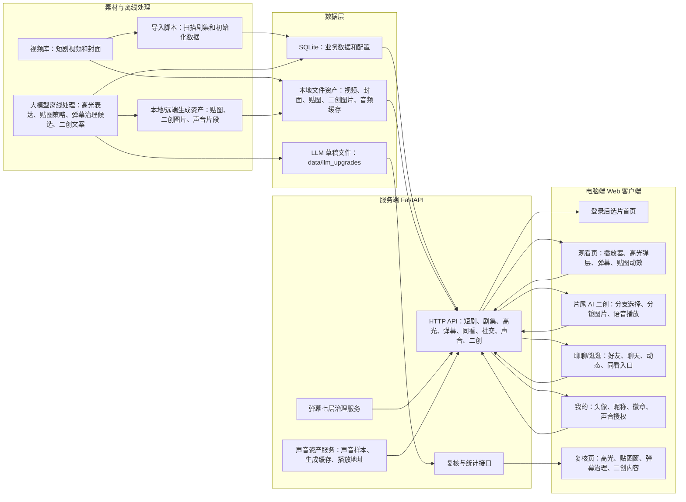
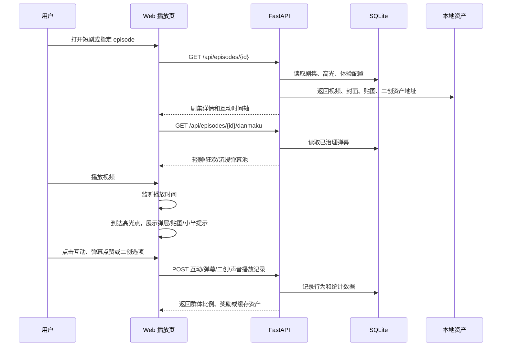
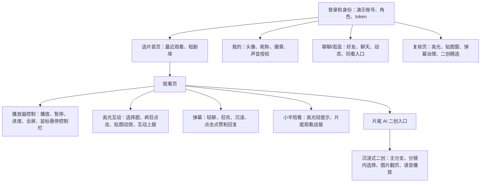
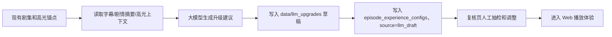
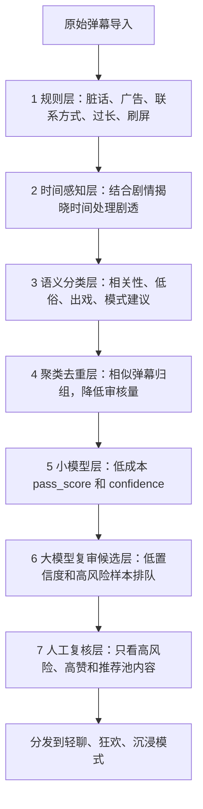
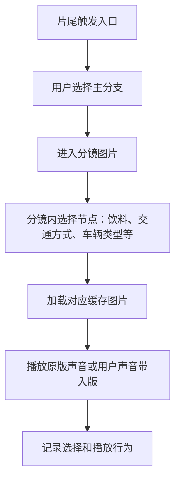
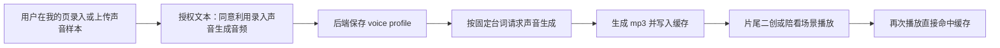

# 半句系统架构

更新时间：2026-06-11

## 当前定位

“半句”当前主线是电脑端 Web 版本。目标不是把所有未来能力一次做完，而是先形成可展示、可复核、可迭代的完整闭环：

短剧素材导入 → 高光与弹幕治理 → Web 播放互动 → 用户行为上报 → 后台统计/复核 → 模型与配置继续优化。

Android / iOS 原生客户端仍作为后续方向。当前 Web 主线和原生探索需要保持分支隔离，避免互相影响。

## 总体架构

## 运行时主链路

## 数据层

当前使用 SQLite 和本地文件系统，适合比赛演示、本地开发和临时公网隧道展示。

核心数据分为五类：

- 内容数据：短剧、剧集、视频地址、封面、播放时长。
- 互动数据：高光点、互动模板、贴图时间窗、点击/选择上报。
- 治理数据：弹幕、弹幕审核结果、聚类、时间感知判断、小模型元数据。
- 社交数据：用户、好友申请、聊天、同看房间、动态、评论点赞。
- AI 资产数据：片尾二创分支、分镜图片、声音 profile、生成音频缓存、小半陪看战报。

生产化时建议迁移为：

- PostgreSQL：替代 SQLite，承接用户、内容、互动、社交和审核数据。
- 对象存储：承接视频、封面、头像、声音样本、生成图片和音频缓存。
- Redis：承接同看房间临时状态、在线成员、消息推送和热点缓存。

## Web 客户端模块

设计原则：

- 当前只考虑电脑端 Web 展示，不再为 WebView 壳做强适配。
- 播放页优先保证视频区域沉浸，弹层和贴图避开画面中心。
- 控制栏在鼠标移动时出现，静止后隐藏。
- 片尾二创只在接近结尾或用户显式进入时展示，避免和最后一个高光互相抢时机。

## 20 集 LLM 高光与贴图升级链路

当前已经对 20 集完成一轮离线升级。该链路不重新决定“这一集有几个高光”，而是在已有人工/模型时间锚点基础上优化表达和素材策略。

当前策略：

- 保留原高光数量和触发时间，降低误改剧情节奏的风险。
- 重点升级高光标题、情绪描述、互动按钮、贴图文案和贴图时间窗。
- 每集生成体验配置草稿，标记为 `llm_draft`，正式演示前仍建议抽查重点剧集。
- 批量结果保存在 `data/llm_upgrades/`，总览文件为 `summary_all.json`。

## 七层弹幕治理架构

弹幕治理不依赖单一人工审核，而是分层过滤、分层解释、分层复核。

关键点：

- 轻聊模式：低密度、低遮挡，默认适合观看。
- 狂欢模式：允许更多重复和情绪弹幕，适合展示氛围。
- 沉浸模式：关闭或极低密度弹幕，只保留关键互动。
- 小模型当前用于弹幕治理，不等同于高光识别小模型。
- 大模型复审层当前是离线候选队列，不做每条弹幕实时调用，避免成本和延迟失控。

## 小半陪看与片尾战报

“小半”是固定陪看角色，不是开放式智能体。当前职责很窄：

- 在高光前后给轻提示，不抢剧情。
- 在片尾根据本集互动、点击、选择和奖励生成观看战报。
- 战报支持 3D 形象和眼睛动效展示。

设计边界：

- 不读取用户隐私内容。
- 不做开放式闲聊。
- 不替代弹幕和同看社交。
- 只使用当前剧集、当前互动和用户可见数据生成展示反馈。

## 片尾 AI 二创链路

片尾 AI 二创当前采用“预生成 + 缓存 + 可选择分支”的方式，不做实时视频生成。

当前实现重点：

- 北往第一集优先完成三条剧情方向。
- 每条分支包含可变选项，形成不同用户的差异化体验。
- 图片和音频尽量提前生成并缓存，避免演示时等待模型。
- 用户进入二创后采用全屏沉浸式覆盖层，适配普通播放和全屏播放。

## 声音资产缓存链路

当前策略：

- 只为预设文本生成声音，不做实时自由对话。
- 原版声音和用户声音带入版分开缓存，避免串音。
- 生成结果以文件形式保存，前端只拿播放地址。
- 部署到手机或公网环境时，声音服务可以继续在服务端运行，客户端不需要携带模型文件。

## 后台复核与版本管理

复核页承担“把 AI 草稿变成可展示内容”的职责：

- 高光复核：高光名称、类型、触发时间、互动按钮、来源和版本。
- 贴图窗复核：贴图素材、出现时间、持续时间、位置策略和点击效果。
- 弹幕治理复核：低风险放行、高风险拦截、剧透延后、模式归类。
- 二创精选复核：分支文案、分镜图片、声音台词和是否展示。
- 模型版本追踪：通过 `source`、`model_version`、`confidence`、`review_status` 等字段说明来源。

## 当前边界与风险

- 当前数据库是 SQLite，适合演示，不适合多人高并发生产环境。
- 当前声音授权、头像、动态、弹幕删除等功能已有产品雏形，正式上线前必须补齐隐私协议、用户删除入口和管理员审计。
- 当前 AI 生成图片、语音和二创内容以演示资产为主，正式上线前需要增加版权、肖像、敏感内容和未成年人保护策略。
- 当前大模型调用主要用于离线批处理，不建议把每条用户实时输入都交给大模型。

## 后续架构演进

1. 服务端生产化：FastAPI + PostgreSQL + Redis + 对象存储 + HTTPS。
2. 内容治理生产化：规则配置后台、小模型批处理、LLM 离线复审、人工审核台。
3. 资产生产化：图片、音频、头像、声音样本独立存储并建立生命周期管理。
4. 客户端生产化：Web 先稳定，后续再评估 Android/iOS 原生或跨端方案。
5. 隐私合规：补齐声音授权、用户数据导出/删除、内容举报和审核记录。
