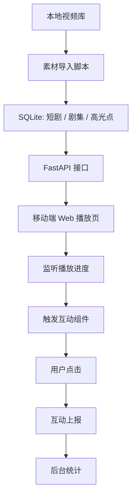

# V1 技术方案

## 当前版本目标

V1 优先证明完整闭环：短剧播放到高光点时自动触发互动组件，用户点击后服务端记录数据，后台可以看到高光点互动效果。

## 核心流程

## 数据来源策略

- V1：演示高光点由规则生成，字段标记为 `manual_seed`。
- V1.1：接入大模型离线标注，人工复核后写入数据库。
- V2：当人工复核数据足够后，再训练小模型。

## 关键字段

- `source`：标注来源，例如 `manual_seed`、`llm`、`human_review`。
- `confidence`：高光点置信度。
- `model_version`：模型或标注策略版本。
- `highlight_type`：爽点、反转、冲突、甜蜜、虐点等。
- `emotion`：爽、震惊、愤怒、心动、心疼等。

