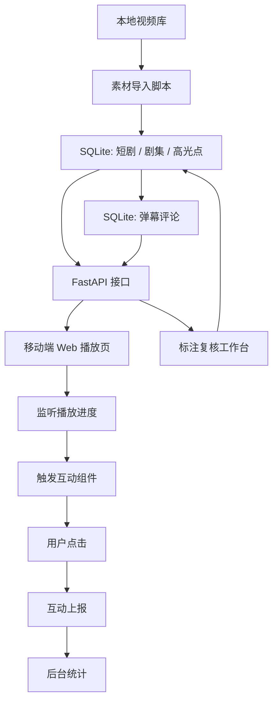

# V1 技术方案

## 当前版本目标

V1 优先证明完整闭环：短剧播放到高光点时自动触发互动组件，用户点击后服务端记录数据，后台可以看到高光点互动效果。

## 核心流程

## 数据来源策略

- V1：演示高光点由规则生成，字段标记为 `manual_seed`。
- V1.1：接入大模型离线标注，人工复核后写入数据库，字段标记为 `human_review`。
- V2：当人工复核数据足够后，再训练小模型。

## 高光分类体系

第一版统一为 8 个一级类型，避免“高能名场面”和“爽点/反转/冲突”互相重复：

| 类型 | 适用剧情 | 默认互动 |
| --- | --- | --- |
| 冲突对抗 | 对峙、争吵、打斗、立场冲突 | 站队投票 |
| 反转揭秘 | 身份反转、真相揭露、误会解开 | 震惊反应 |
| 爽点逆袭 | 打脸、翻盘、强者出手、处境逆转 | 爽值连击 |
| 甜蜜心动 | 撒糖、守护、暧昧、关系升温 | 心动反应 |
| 虐心共情 | 离别、牺牲、委屈、崩溃 | 情绪共情卡 |
| 悬念钩子 | 关键线索、危机未解、结尾吊胃口 | 剧情预测 |
| 搞笑解压 | 反差笑点、误会喜剧、夸张表演 | 哈哈弹幕 |
| 危机紧张 | 追杀、倒计时、危险逼近 | 紧张值 |

“名场面”不再作为一级分类，而是作为强动效或展示标签使用。

## 高光节奏规则

- 一集 2-5 分钟时，通常只保留 3-5 个最强情绪峰值。
- 两个高光点尽量间隔 25 秒以上，前端还会做短冷却，防止连环弹窗。
- 普通铺垫、信息交代、转场不强行标高光，保留观看对比度。

## 弹幕体验

- 沉浸模式：关闭弹幕，只保留高光互动。
- 轻聊模式：默认模式，少量半透明弹幕，不遮挡剧情。
- 狂欢模式：弹幕密度更高，适合演示互动氛围。
- 播放器支持字号、速度、显示区域、透明度设置。

## 标注复核工作台

- 用 `/api/admin/episodes` 查看每集的复核状态和高光来源分布。
- 用 `/api/admin/review-status` 展示已复核、待复核、人工高光数量。
- 用 `/api/admin/episodes/{episode_id}/highlights` 读取和保存单集高光 JSON。
- 第一版把 `human_review` 作为“已复核”的判断标准；`manual_seed` 和模型初稿都进入待复核队列。

## 关键字段

- `source`：标注来源，例如 `manual_seed`、`llm`、`human_review`。
- `confidence`：高光点置信度。
- `model_version`：模型或标注策略版本。
- `highlight_type`：冲突对抗、反转揭秘、爽点逆袭、甜蜜心动、虐心共情等。
- `emotion`：爽、震惊、愤怒、心动、心疼等。
